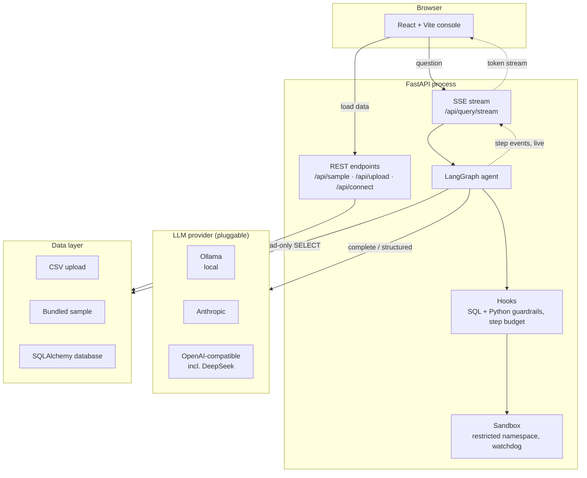
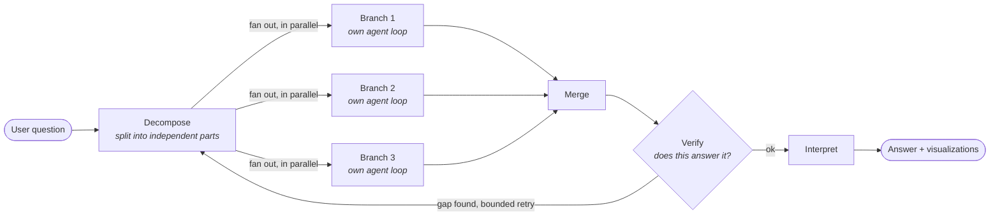
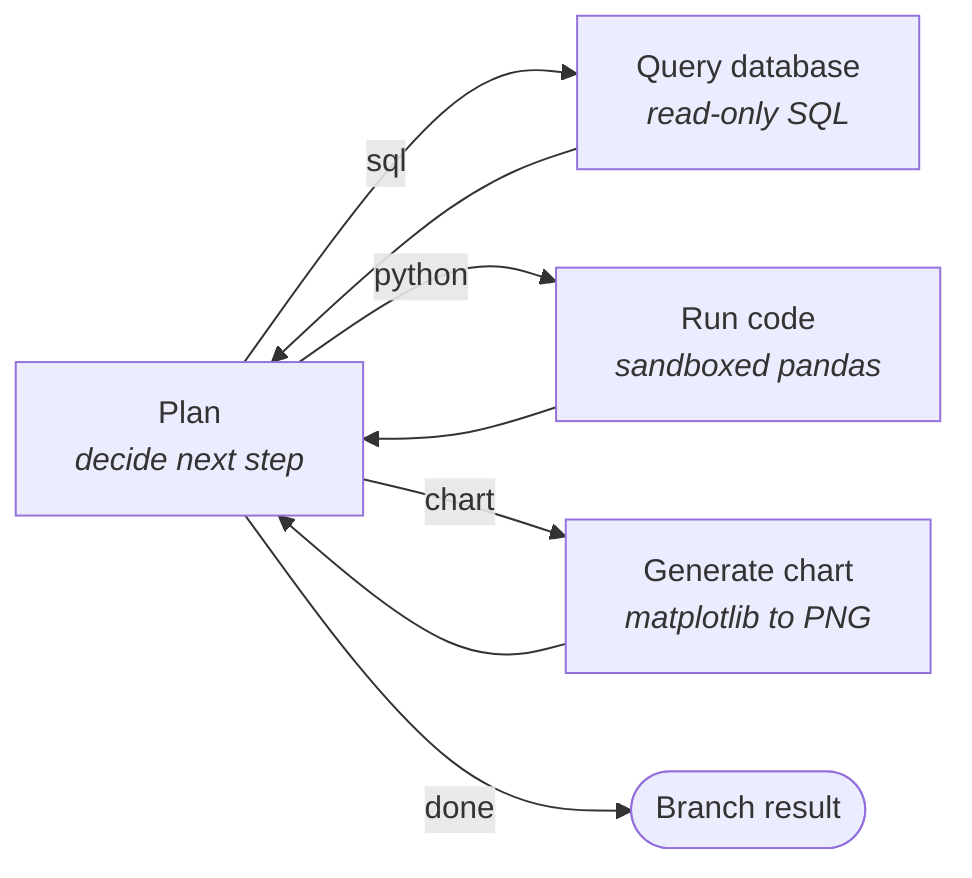
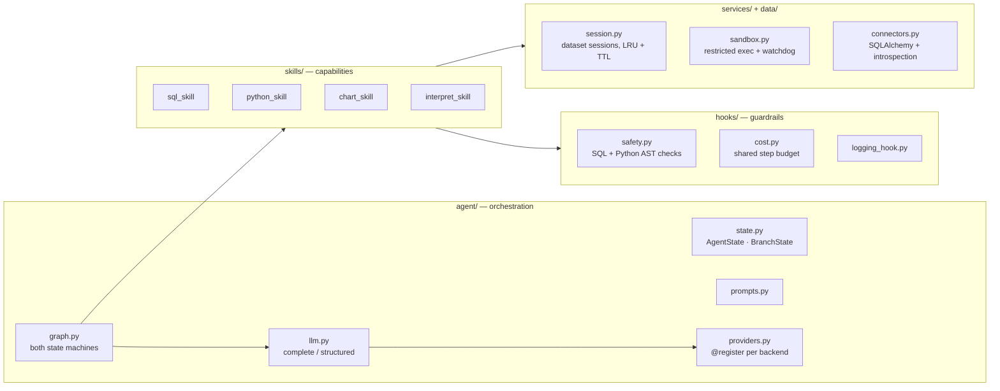
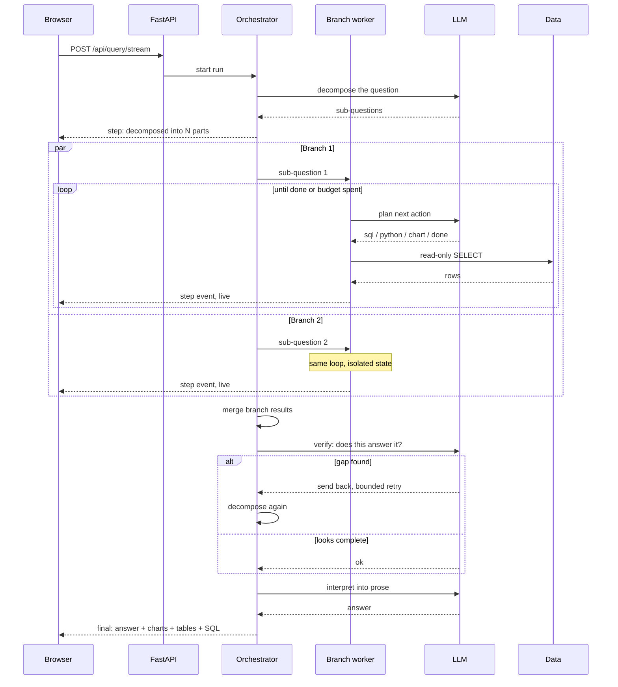
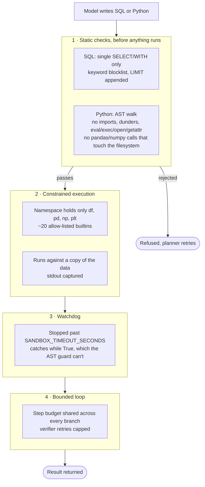

# Prism

**An AI data analyst agent.** Ask a question about your data in plain English. The agent splits it into independent parts, works on them **in parallel**, checks its own results before answering, and shows the whole graph running live.


*One question, "revenue by region as a chart and revenue by category", split into two tasks that run at the same time. Sped up 3x.*


Runs fully local by default. The model (via [Ollama](https://ollama.com)), the database and the analysis sandbox all sit on your machine, so there are no API keys and no data leaves the box. If you'd rather use a hosted model, one environment variable switches the whole thing to Claude or GPT. The provider layer is pluggable.

**New here? Start with [PROJECT_GUIDE.md](PROJECT_GUIDE.md).** It walks through what every part does, how a question flows through the system, and how to run it from scratch on Windows, macOS or Linux.


## What it does

1. **Bring data.** Upload a CSV, connect a SQL database (Postgres, MySQL, SQLite), or load the bundled sample of 1,400 sales orders.


2. **Ask in plain English.** *"Which product has the highest average discount?"* or *"Show the monthly revenue trend as a chart"*.
3. **Watch it work.** Each answer carries a collapsible panel showing every step the agent took, streamed live while it runs and folded away when it finishes.
4. **Get a grounded answer.** The answer itself, plus the SQL it wrote, the result table, any pandas analysis, and the chart.


Bar and line charts are redrawn as interactive SVG, so you can hover any bar or point to read its exact value. Shapes that can't be reproduced faithfully, like pie and bubble charts, come through as the image the agent drew:


## Architecture

### The whole system

One React app, one FastAPI process, one agent. The provider and the data source are both swappable, and neither the agent nor the UI knows which one is active.



Every node execution pushes an event onto the stream as it finishes, so the UI reports parallel branches live and interleaved rather than in one lump at the end.

### The agent, two levels

Two levels, both built as explicit [LangGraph](https://langchain-ai.github.io/langgraph/) state machines.

The **orchestrator** works out how many independent sub-questions a request really contains, runs a worker for each one at the same time, merges what they found, then hands the lot to a **verifier** that can send everything back for another pass. Each **worker** is a self-contained agent loop with its own isolated state.



Inside each branch is the loop the project started with:



*"Revenue by region and by category"* becomes two branches running concurrently. *"Total revenue by region"* stays a single branch and behaves exactly like the original loop. The extra machinery only shows up when the question genuinely has independent parts.

### How the code is organised

Three ideas, and each one is a directory:



- **Skills** are the agent's capabilities as pluggable modules. Each exposes `NAME`, `DESCRIPTION` and `run(...)`, and returns a uniform `SkillResult`. Adding a capability means adding a file and one line in `skills/__init__.py`.
- **Hooks** are the cross-cutting guardrails wrapped around every step: SQL and Python safety validation, a budget tracker that caps the loop, structured logging.
- **The graph** holds both state machines and the streaming plumbing.

### A question, end to end

What actually happens between pressing enter and seeing an answer:



There's a deeper walkthrough of the state design, streaming and trade-offs in [`docs/architecture.md`](docs/architecture.md).

## Choosing the model

Switching provider is one environment variable. Ollama is the default so the project runs with no account at all, and the same agent runs on the Claude API or OpenAI without touching a line of code. All three provider packages ship in `requirements.txt`, so there is nothing extra to install.

**Claude**, which is what the screenshots and the demo above were recorded on:

```bash
export LLM_PROVIDER=anthropic
export ANTHROPIC_API_KEY=sk-ant-...
export LLM_MODEL=claude-sonnet-4-6
uvicorn app.main:app --reload --port 8000
```

**OpenAI:**

```bash
export LLM_PROVIDER=openai
export OPENAI_API_KEY=sk-...
export LLM_MODEL=gpt-4o-mini
```

**DeepSeek**, which speaks the OpenAI schema, so it runs through the same `openai` provider with a different base URL:

```bash
export LLM_PROVIDER=openai
export OPENAI_API_KEY=sk-...
export OPENAI_BASE_URL=https://api.deepseek.com/v1
export LLM_MODEL=deepseek-v4-flash
export LLM_EXTRA_BODY='{"thinking": {"type": "disabled"}}'
```

That last line isn't optional, and it's worth knowing why. DeepSeek's V4 models run in **thinking mode by default**, and thinking mode refuses a forced tool choice — it returns `400 Thinking mode does not support this tool_choice`. The agent's planner, decomposer and verifier all ask for structured output, which is exactly that kind of forced call, so without `LLM_EXTRA_BODY` every question fails. Turning thinking off also makes the whole thing considerably faster, since none of the token budget goes to reasoning the agent never reads.

Two more DeepSeek-specific notes:

- **Use the short model name.** `deepseek-v4-flash` works; the NVIDIA-style `deepseek-ai/deepseek-v4-flash-0731` is NIM's naming and 404s on DeepSeek's own endpoint.
- **Keys start with `sk-`**, and come from https://platform.deepseek.com → API keys. It's prepaid, so the account needs a balance before the first question.

Whichever provider answers is shown in the pill in the app header, so you always know what produced an answer.

`ANTHROPIC_BASE_URL` and `OPENAI_BASE_URL` point the provider at any compatible endpoint instead of the public API, which covers LM Studio, vLLM, Groq and self-hosted proxies. Two things worth knowing if you go that route:

- **Model names can differ from the public ones.** An endpoint might serve `claude-sonnet-4-6@default` where the public API just calls it `claude-sonnet-4-6`. Run `python list_models.py` from the `backend` folder and it will ask your endpoint what it actually serves, then tell you whether your current `LLM_MODEL` is on the list.
- **Some models reject `temperature` outright**, returning a 400 that says the parameter is deprecated. No value satisfies them, so set `LLM_TEMPERATURE=` (blank) to leave it out of the request entirely.

If the backend can't reach the model, whether that's Ollama not running or a bad key, you get a readable message saying what to check rather than a stack trace.

Adding another provider is one registered function in `backend/app/agent/providers.py`.

## Why the design assumes the model will fail

The project was built against a small local model first, which forced a useful discipline: nothing here trusts the model. That turned out to be worth keeping once it ran on a frontier model too, because a good model still has bad days, and the failure modes are quieter when it does.

- Every generated query is validated before it touches the database: single statement, `SELECT` or `WITH` only, forbidden keywords rejected, row limit enforced.
- Failed SQL is retried with the error message fed back to the model.
- Generated Python is AST-checked and then run in a restricted sandbox with a minimal builtins allow-list.
- If the model can't produce a structured planning decision, a heuristic fallback routes the step instead of crashing.
- A step budget stops any planner loop and forces a best-effort answer.
- Sub-questions that duplicate each other are dropped before they run, so the same query doesn't get billed twice.

## Project structure

```
prism-data-agent/
├── backend/
│   ├── app/
│   │   ├── agent/                # LangGraph orchestration
│   │   │   ├── graph.py          # worker loop + parallel orchestrator, run/stream
│   │   │   ├── state.py          # AgentState + per-branch BranchState, reducers
│   │   │   ├── prompts.py        # decomposer, planner, skill and verifier prompts
│   │   │   ├── providers.py      # pluggable LLM backends (ollama/anthropic/openai)
│   │   │   └── llm.py            # provider-agnostic complete()/structured()
│   │   ├── skills/               # pluggable capabilities
│   │   │   ├── sql_skill.py      # question to SQL, validate, execute, retry
│   │   │   ├── python_skill.py   # sandboxed pandas analysis
│   │   │   ├── chart_skill.py    # matplotlib to base64 PNG
│   │   │   └── interpret_skill.py
│   │   ├── hooks/                # cross-cutting guardrails
│   │   │   ├── safety.py         # SQL + Python (AST) validation
│   │   │   ├── cost.py           # step budget, shared across branches
│   │   │   └── logging_hook.py
│   │   ├── data/                 # SQLAlchemy connectors + introspection
│   │   ├── services/             # dataset sessions, execution sandbox
│   │   ├── schemas.py            # API models
│   │   ├── config.py             # settings (env-overridable)
│   │   └── main.py               # FastAPI app + SSE streaming endpoint
│   ├── data/samples/sales.csv
│   ├── tests/                    # 176 tests, LLM fully mocked (run anywhere)
│   ├── list_models.py            # ask the configured endpoint what it serves
│   ├── requirements.txt
│   └── requirements-dev.txt
├── frontend/                     # React + Vite console
│   └── src/components/
│       ├── AgentThinking.jsx     # collapsible live reasoning panel
│       ├── ChatPanel.jsx         # feed, suggestions, composer
│       ├── DataChart.jsx         # interactive SVG charts with hover values
│       ├── DataUpload.jsx        # sample, CSV upload, database connect
│       ├── Markdown.jsx          # renders the model's markdown answers
│       └── ResultView.jsx        # answer, charts, tables, generated code
├── docs/
│   ├── architecture.md
│   └── images/                   # demo gif, diagram, screenshots
├── Dockerfile                    # single image: React build + API, for deployment
├── docker-compose.yml            # ollama + backend + frontend, for local work
├── RENDER.md                     # deploying the single image
└── .github/workflows/ci.yml      # lint + tests + frontend build
```

## Quickstart

You need **Python 3.11+**, **Node 18+** and **[Ollama](https://ollama.com/download)**.

**1. Get the model** (once):

```bash
ollama pull qwen2.5
```

Any tool-capable model works. Bigger models write noticeably better SQL; smaller ones lean harder on the retry and fallback machinery, which is fun to watch in the trace.

**2. Backend** (terminal 1):

```bash
cd backend
python -m venv .venv

# macOS / Linux:
source .venv/bin/activate
# Windows (PowerShell):
# .venv\Scripts\Activate.ps1

pip install -r requirements.txt
uvicorn app.main:app --reload --port 8000
```

**3. Frontend** (terminal 2):

```bash
cd frontend
npm install
npm run dev
```

Open **http://localhost:5173**, click **Load sample dataset**, and try *"Show the monthly revenue trend as a chart"*. Then try *"Revenue by region as a chart and revenue by category"* to see it split into two branches and run them at once.

### Docker

```bash
docker compose up --build
docker compose exec ollama ollama pull qwen2.5   # once
```

Frontend on http://localhost:5173, API on port 8000, Ollama on 11434.

## Configuration

Everything is an environment variable. Copy `backend/.env.example` to `backend/.env` and edit.

| Variable | Default | Purpose |
| --- | --- | --- |
| `LLM_PROVIDER` | `ollama` | `ollama`, `anthropic` or `openai` |
| `LLM_MODEL` | provider default | Overrides the model for whichever provider is active |
| `LLM_TEMPERATURE` | `0.0` | Leave blank to omit it from the request |
| `LLM_TOP_P` | | Nucleus sampling. Blank leaves it to the provider |
| `LLM_MAX_TOKENS` | `2048` | Ceiling on what the model may write per call |
| `LLM_REQUEST_TIMEOUT` | `180` | Seconds per call. One question is several calls |
| `LLM_EXTRA_BODY` | | Raw JSON merged into the request, for provider-specific switches like thinking mode |
| `ANTHROPIC_API_KEY` / `OPENAI_API_KEY` | | Only for hosted providers |
| `ANTHROPIC_BASE_URL` / `OPENAI_BASE_URL` | | Point at a gateway or compatible server |
| `OLLAMA_BASE_URL` | `http://localhost:11434` | Where Ollama listens |
| `OLLAMA_MODEL` | `qwen2.5` | Ollama's default model |
| `MAX_AGENT_STEPS` | `16` | Hard cap on planner steps, shared across all branches |
| `MAX_PARALLEL_BRANCHES` | `3` | Sub-questions run at once. Set to `1` for the classic single loop |
| `MAX_VERIFY_PASSES` | `1` | How often the verifier may send work back |
| `ENABLE_VERIFIER` | `true` | Turns the verification node off entirely |
| `MAX_SQL_ROWS` | `1000` | Row limit appended to generated queries |
| `SQL_RETRY_ATTEMPTS` | `1` | Extra tries after a failed query |
| `SANDBOX_TIMEOUT_SECONDS` | `30` | Wall-clock cap on one generated snippet |
| `MAX_UPLOAD_MB` | `25` | Upload size cap |
| `MAX_SESSIONS` / `SESSION_TTL_MINUTES` | `24` / `120` | Session eviction |
| `LOG_LEVEL` | `INFO` | App log verbosity |
| `APP_USERNAME` / `APP_PASSWORD` | | Set both to put the whole app behind a browser login. Blank means no prompt |
| `ENABLE_DB_CONNECT` | `true` | Turns `/api/connect` off. The deployment image sets it `false` |

## Testing

```bash
cd backend
pip install -r requirements-dev.txt
python -m pytest
ruff check app tests list_models.py
```

176 tests, and the LLM is mocked in every one of them, so the suite runs anywhere including CI without Ollama installed. What's under test is everything around the model:

- the SQL guardrail and the Python AST guardrail
- the sandbox, including the filesystem escape routes and the execution watchdog
- the data layer, the API endpoints and the server limits
- the worker loop: re-analyse cycle, heuristic fallback, budget stop
- the orchestration layer: decomposition, real thread-level parallelism, fan-in, verifier retries and their bound, branch isolation
- provider selection, model resolution and outage handling
- the concurrency bugs that only appear once branches run at once: parallel chart rendering, interleaved database reads, the shared step counter
- JSON serialization on the streaming path, which browsers are stricter about than Python is

Model quality changes the answers. It shouldn't change whether the system is safe or correct, and that's what the suite is there to hold.

## Security model

Running model-generated SQL and Python is the central risk here, and it's handled in layers. Anything the model writes has to get through all of them:



**SQL** is parsed with `sqlparse`. Only a single `SELECT` or `WITH` statement passes, there's a token-level keyword blocklist (`DROP`, `INSERT`, `PRAGMA`, `ATTACH` and friends), and a `LIMIT` is appended automatically.

**Python** is AST-inspected before execution. Imports, dunder access and `eval`/`exec`/`open`/`getattr` are rejected, along with the pandas and numpy calls that reach the filesystem (`to_csv`, `read_pickle`, `np.save`, `savefig` and the rest). That last group is easy to miss: `df.to_csv("/etc/cron.d/x")` is an ordinary attribute call on a name the snippet is supposed to have.

**Execution** then happens in a namespace holding a roughly twenty-function builtins allow-list, a copy of the DataFrame, captured stdout, and a narrow `__import__` that only ever returns already-loaded numpy and pandas internals.

**A watchdog** stops any snippet that overruns `SANDBOX_TIMEOUT_SECONDS`. Nothing in the AST guard rejects `while True:`, and in CPython a tight loop like that starves every other thread of the GIL rather than just hanging its own request.

**The agent loop** is bounded by the step budget.

Honest caveat: this is pragmatic hardening for a local, single-user tool, not a jail. CPython can't be made fully safe from inside the process. For untrusted or multi-tenant use you'd want the execution step in a separate process with OS-level resource limits or a container sandbox, databases connected with read-only credentials, and auth plus rate limiting on the API. [SECURITY.md](SECURITY.md) names the remaining gaps rather than pretending there aren't any.

## Extending the agent

Adding a capability, say forecasting:

1. Create `backend/app/skills/forecast_skill.py` exposing `NAME`, `DESCRIPTION` and `run(...) -> SkillResult`.
2. Register it in `backend/app/skills/__init__.py`.
3. Add a node and a loop-back edge in `backend/app/agent/graph.py`, plus the action in the planner prompt.
4. The thinking panel picks it up automatically from the streamed steps.

## Roadmap

- Conversation-scoped memory of intermediate DataFrames, so follow-ups don't re-query
- Dependent sub-questions. Branches have to be independent today; a DAG would let one feed another
- Multiple tables and joins with schema selection
- Result caching keyed on question and schema
- Export a run as a shareable notebook

## License

[MIT](LICENSE)