<p align="center">
  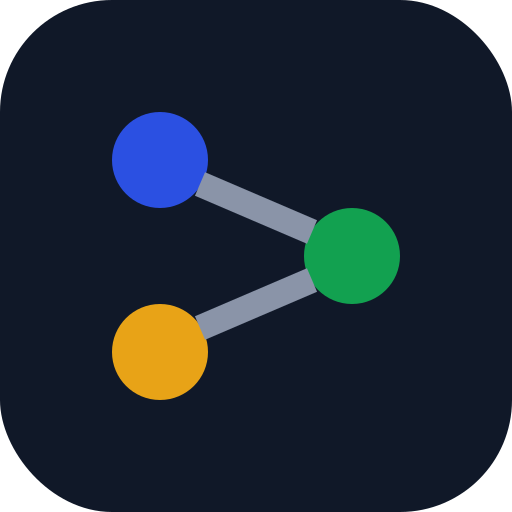
</p>

<h1 align="center">Prism</h1>

<p align="center">
  <strong>Ask your data questions in plain English.</strong><br>
  A LangGraph agent splits the question up, writes the SQL, runs pandas, draws the charts<br>
  and checks its own answer, showing every step live while it works.
</p>

<p align="center">
  <a href="https://github.com/asadaslam556/prism-data-agent/actions/workflows/ci.yml"></a>
  <a href="https://github.com/asadaslam556/prism-data-agent/security/code-scanning"></a>
  
  
  <a href="LICENSE"></a>
</p>

<p align="center">
  <a href="#quickstart">Quickstart</a> ·
  <a href="#architecture">Architecture</a> ·
  <a href="#security-model">Security</a> ·
  <a href="docs/README.md">Docs</a> ·
  <a href="CHANGELOG.md">Changelog</a>
</p>

<p align="center">
  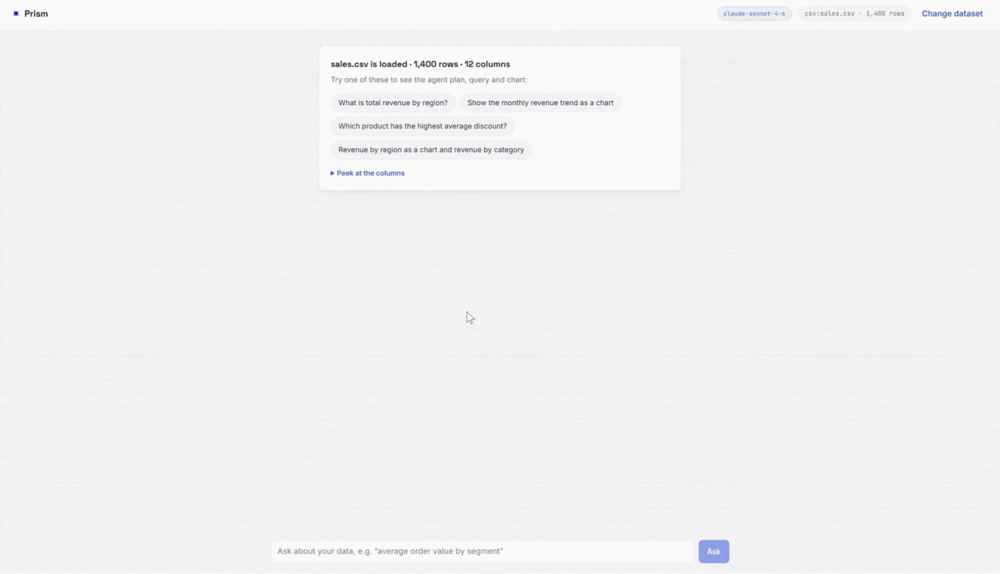
  <br>
  <em>One session on the bundled sample: a simple question, a monthly trend as a line chart, a two-part question that runs as parallel tasks, and KPI cards.</em>
</p>

---

## Contents

- [Highlights](#highlights)
- [What it looks like](#what-it-looks-like)
- [Tech stack](#tech-stack)
- [Quickstart](#quickstart)
- [Using a hosted model](#using-a-hosted-model)
- [Configuration](#configuration)
- [Architecture](#architecture)
- [Security model](#security-model)
- [Deployment](#deployment)
- [Testing](#testing)
- [Project structure](#project-structure)
- [Extending it](#extending-it)
- [Roadmap](#roadmap)
- [Documentation](#documentation)

## Highlights

- **Runs on your machine.** The model (through [Ollama](https://ollama.com)), the database and the code sandbox all stay local. No API keys, and your data never leaves the box.
- **Parallel by design.** A question with independent parts is split into separate agent loops that run at the same time, then merged.
- **Checks its own work.** A separate verifier looks at the merged results and can send the work back for another pass.
- **Shows its reasoning.** Every step streams to the browser as it happens, and folds away once the answer arrives.
- **Safe to point at real data.** Generated SQL is read-only and row-capped; generated Python runs in a sandbox with static checks, restricted modules, a runtime audit hook and a watchdog.
- **Swappable model.** One environment variable moves from Ollama to OpenAI or any OpenAI-compatible service, such as DeepSeek or Groq.

## What it looks like

| Load data | Get a grounded answer |
| :---: | :---: |
| 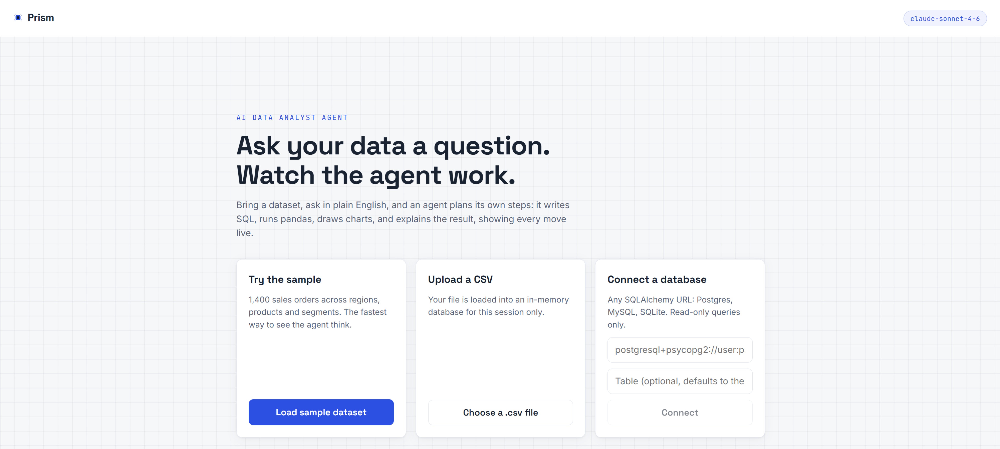 | 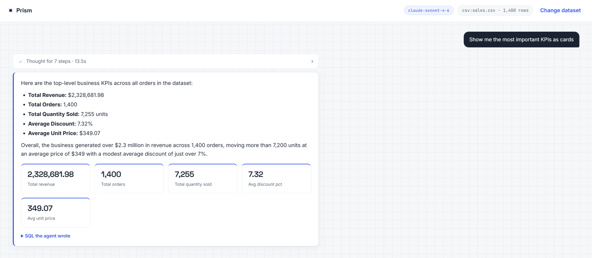 |
| Upload a CSV, connect Postgres, MySQL or SQLite, or use the bundled 1,400-order sample. | The answer, plus the SQL it wrote, the result table, any pandas analysis and the chart. |

| The agent graph | A chart it drew |
| :---: | :---: |
| 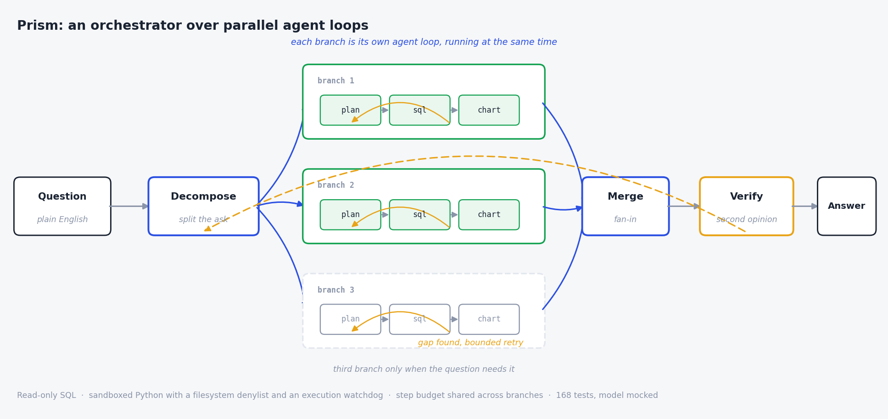 | 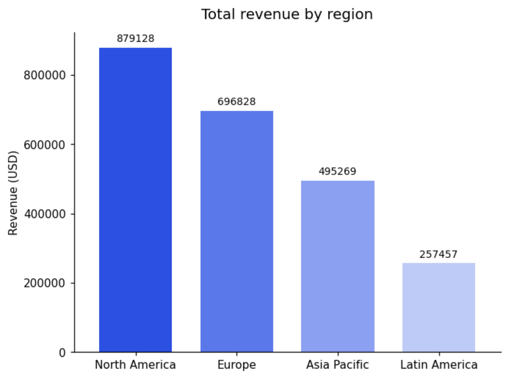 |
| Decompose, fan out, merge, verify, answer. | Bar and line charts are redrawn as SVG with hover values; anything else is shown as drawn. |

## Tech stack

<p align="center">
  
</p>

| Layer | Built with | Why |
| --- | --- | --- |
| Frontend |   | A small console with no runtime dependencies beyond React. Charts and markdown are drawn by hand. |
| API |   | REST endpoints plus a Server-Sent Events stream for live steps. |
| Agent |   | Two explicit state graphs: an orchestrator and a worker loop. |
| Models |    | Local by default, hosted with one variable. |
| Analysis |    | The sandboxed analysis and charting environment. |
| Data |    | Every dataset sits behind one SQLAlchemy engine, whatever its source. |
| Quality |    | Tests with the model mocked, linting, and code scanning on every push. |
| Delivery |    | One deployment image, CI on Python 3.11 and 3.12, hosted on Render. |

## Quickstart

You need **Python 3.11+**, **Node 20.19+** and **[Ollama](https://ollama.com/download)**.

**1. Pull a model** (once):

```bash
ollama pull qwen2.5
```

Any tool-capable model works. Bigger models write better SQL; smaller ones lean harder on the retry and fallback logic.

**2. Start the backend** (terminal 1):

```bash
cd backend
python -m venv .venv
source .venv/bin/activate        # Windows: .venv\Scripts\Activate.ps1
pip install -r requirements.txt
uvicorn app.main:app --reload --port 8000
```

**3. Start the frontend** (terminal 2):

```bash
cd frontend
npm install
npm run dev
```

Open http://localhost:5173, click **Load sample dataset**, and try *"Show the monthly revenue trend as a chart"*. Then try *"Revenue by region as a chart and revenue by category"* to watch it split into two tasks.

On Windows, [docs/windows.md](docs/windows.md) walks through the same steps in PowerShell.

<details>
<summary><strong>Or run everything with Docker</strong></summary>

```bash
docker compose up --build
docker compose exec ollama ollama pull qwen2.5   # once
```

Frontend on http://localhost:5173, API on port 8000, Ollama on 11434.

</details>

## Using a hosted model

Set `LLM_PROVIDER=openai` and a key, then restart the backend. The provider package is already in `requirements.txt`.

**OpenAI:**

```bash
export LLM_PROVIDER=openai
export OPENAI_API_KEY=sk-...
export LLM_MODEL=gpt-4o-mini
```

**DeepSeek**, or any other OpenAI-compatible service, uses the same provider with a different base URL:

```bash
export LLM_PROVIDER=openai
export OPENAI_API_KEY=sk-...
export OPENAI_BASE_URL=https://api.deepseek.com/v1
export LLM_MODEL=deepseek-v4-flash
export LLM_EXTRA_BODY='{"thinking": {"type": "disabled"}}'
```

> [!IMPORTANT]
> Don't skip the last line. DeepSeek's V4 models run in thinking mode by default, and thinking mode rejects a forced tool choice (`400 Thinking mode does not support this tool_choice`). The planner, decomposer and verifier all rely on exactly that, so without it every question fails. Turning thinking off also makes runs noticeably faster.

A few more things worth knowing:

- `OPENAI_BASE_URL` points the provider at any compatible server: LM Studio, vLLM, Groq, a company gateway.
- Gateways often rename models (`gpt-4o-mini@default`, say). Run `python list_models.py` from `backend/` to list what your endpoint actually serves and check whether `LLM_MODEL` is on it.
- Some models reject `temperature` outright. Set `LLM_TEMPERATURE=` (blank) to leave it out of the request.
- The pill in the app header always shows which provider and model are answering.

If the backend can't reach the model (Ollama not running, a bad key) you get a readable message saying what to check, not a stack trace.

## Configuration

Everything is an environment variable. Copy `backend/.env.example` to `backend/.env` and edit it. The file is read once at startup, so restart the server after changing it.

<details>
<summary><strong>All settings</strong></summary>

| Variable | Default | Purpose |
| --- | --- | --- |
| `LLM_PROVIDER` | `ollama` | `ollama` or `openai` (OpenAI or any compatible endpoint) |
| `LLM_MODEL` | provider default | Overrides the model for whichever provider is active |
| `LLM_TEMPERATURE` | `0.0` | Leave blank to omit it from the request |
| `LLM_TOP_P` | | Nucleus sampling. Blank leaves it to the provider |
| `LLM_MAX_TOKENS` | `2048` | Ceiling on what the model may write per call |
| `LLM_REQUEST_TIMEOUT` | `180` | Seconds per call. One question is several calls |
| `LLM_EXTRA_BODY` | | Raw JSON merged into the request, for provider-specific switches like thinking mode |
| `OPENAI_API_KEY` | | Only for the hosted provider |
| `OPENAI_BASE_URL` | | Point at DeepSeek, Groq, a gateway or any compatible server |
| `OLLAMA_BASE_URL` | `http://localhost:11434` | Where Ollama listens |
| `OLLAMA_MODEL` | `qwen2.5` | Ollama's default model |
| `MAX_AGENT_STEPS` | `16` | Hard cap on planner steps, shared across all branches |
| `MAX_PARALLEL_BRANCHES` | `3` | Sub-questions run at once. `1` gives the plain single loop |
| `MAX_VERIFY_PASSES` | `1` | How often the verifier may send work back |
| `ENABLE_VERIFIER` | `true` | Turns the verification step off entirely |
| `MAX_SQL_ROWS` | `1000` | Row cap on every generated query |
| `SQL_RETRY_ATTEMPTS` | `1` | Extra tries after a failed query |
| `SANDBOX_TIMEOUT_SECONDS` | `30` | Wall-clock cap on one generated snippet |
| `MAX_UPLOAD_MB` | `25` | Upload size cap |
| `MAX_SESSIONS` / `SESSION_TTL_MINUTES` | `24` / `120` | How many datasets stay loaded, and for how long |
| `LOG_LEVEL` | `INFO` | App log verbosity |
| `APP_USERNAME` / `APP_PASSWORD` | | Set both to put the whole app behind a browser login |
| `ENABLE_DB_CONNECT` | `true` | Turns `/api/connect` off. The deployment image sets it to `false` |

</details>

## Architecture

### System overview

One React app, one FastAPI process, one agent. The model provider and the data source are both swappable, and neither the agent nor the UI cares which one is active.

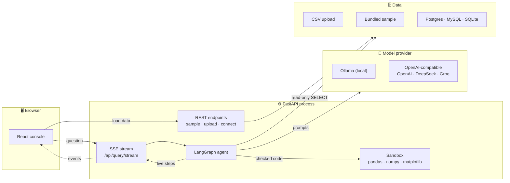

### Layers

The backend is split into layers that only call downwards. Model access sits to the side, because the orchestration layer and the skills both use it.

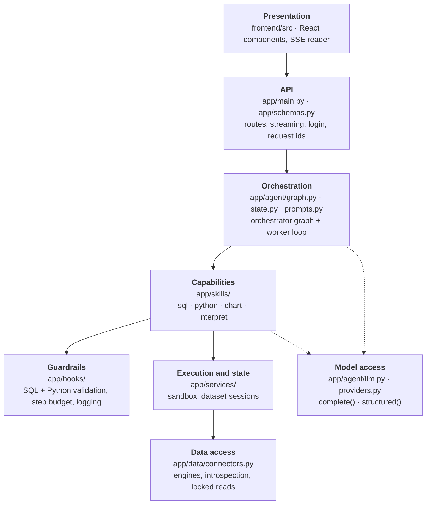

| Layer | Knows about | Doesn't know about |
| --- | --- | --- |
| Presentation | The API's JSON and SSE events | Graphs, models, databases |
| API | Sessions, the agent's `run()` and `stream()` | How the agent decides anything |
| Orchestration | Skills, state, the step budget | SQL dialects, provider SDKs |
| Capabilities | Guardrails, sandbox, connectors, `llm` | The graph they run in |
| Guardrails | Nothing above them | Everything above them |
| Model access | Provider SDKs | Everything else |

### The agent

Two levels, both explicit [LangGraph](https://langchain-ai.github.io/langgraph/) state machines. The **orchestrator** decides how many independent sub-questions a request contains, runs a **worker** for each at the same time, merges the results, and hands them to a **verifier** that can send the work back.


Each branch runs its own plan-act loop with isolated state:

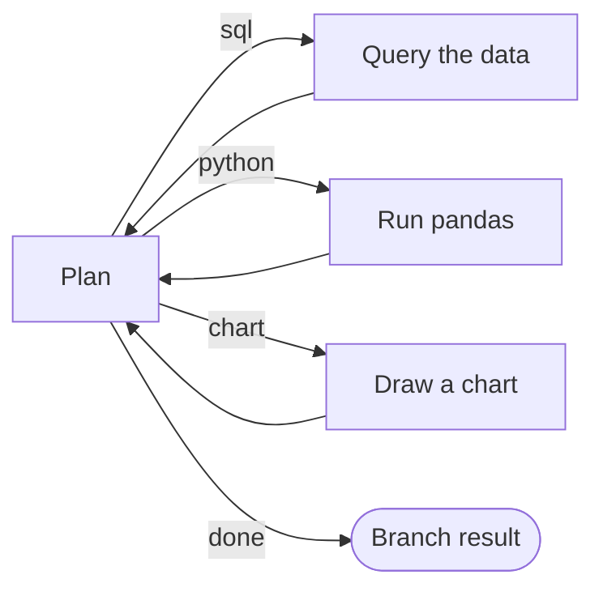

Most questions decompose to a single branch and behave like a plain agent loop. The parallel machinery only kicks in when a question really has independent parts.

### A question, end to end

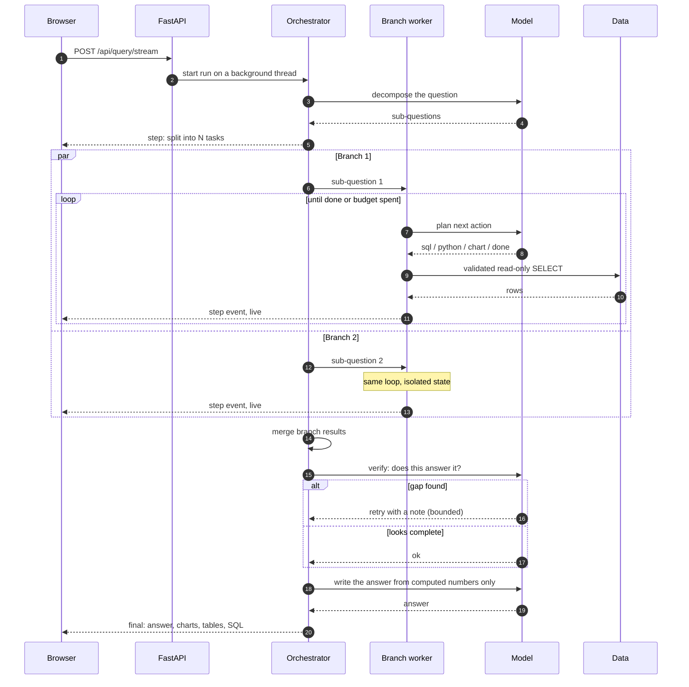

[docs/architecture.md](docs/architecture.md) goes into the state design, streaming and the trade-offs. [docs/guide.md](docs/guide.md) walks through every file.

## Security model

Running SQL and Python that a model wrote is the main risk in this project, so everything the model writes goes through independent layers:

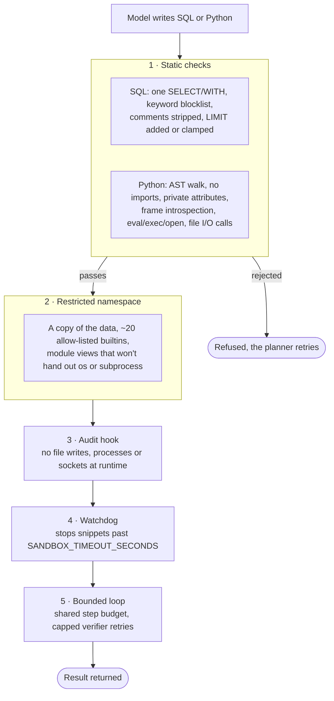

This is hardening for a local, single-user tool, not a jail. CPython can't be fully locked down from inside its own process. [SECURITY.md](SECURITY.md) lists the known gaps and what a multi-tenant deployment would need on top.

## Deployment

The root `Dockerfile` builds one image: the React build is served by FastAPI, so there's one process and one port. It listens on `$PORT` when the host sets one.

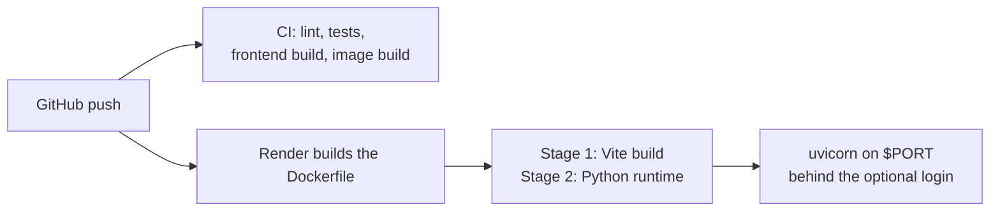

[docs/deploy-render.md](docs/deploy-render.md) walks through putting it on Render's free tier, step by step.

## Testing

```bash
cd backend
pip install -r requirements-dev.txt
python -m pytest
ruff check app tests list_models.py
```

The model is mocked in every test, so the suite runs anywhere, CI included, without Ollama. It covers everything around the model:

- both guardrails, and every sandbox escape route found so far
- the data layer, the API and the server limits
- the worker loop, its fallbacks and the step budget
- the orchestration layer: decomposition, real thread-level parallelism, verifier retries
- provider selection and outage handling
- the concurrency bugs that only appeared once branches ran at the same time

## Project structure

```
prism-data-agent/
├── backend/
│   ├── app/
│   │   ├── agent/          # graphs, state, prompts, model providers
│   │   ├── skills/         # sql, python, chart, interpret
│   │   ├── hooks/          # guardrails, step budget, logging
│   │   ├── services/       # dataset sessions, execution sandbox
│   │   ├── data/           # SQLAlchemy connectors
│   │   ├── config.py       # settings, all overridable by env var
│   │   ├── schemas.py      # API models
│   │   └── main.py         # FastAPI app and SSE endpoint
│   ├── data/samples/       # the bundled sales dataset
│   ├── tests/
│   ├── list_models.py      # asks the configured endpoint what it serves
│   ├── Dockerfile          # backend image for docker-compose
│   └── requirements*.txt
├── frontend/               # React + Vite console
├── docs/                   # architecture, guide, Windows and Render guides
├── Dockerfile              # single deployment image
└── docker-compose.yml      # Ollama + backend + frontend for local use
```

## Extending it

To add a capability, say forecasting:

1. Create `backend/app/skills/forecast_skill.py` exposing `NAME`, `DESCRIPTION` and `run(...) -> SkillResult`.
2. Add a node and a loop-back edge for it in `backend/app/agent/graph.py`, and add the action to the planner prompt.
3. The reasoning panel picks it up from the streamed steps with no frontend change.

A new model provider is one function in `backend/app/agent/providers.py` with `@register("name")` on it.

## Roadmap

- [ ] Keep intermediate DataFrames across a conversation so follow-ups don't re-query
- [ ] Dependent sub-questions, where one branch feeds another
- [ ] Multiple tables and joins
- [ ] Result caching keyed on question and schema
- [ ] Export a run as a notebook

## Documentation

| Document | What's in it |
| --- | --- |
| [docs/architecture.md](docs/architecture.md) | The graph design, state, streaming and safety layering, and why |
| [docs/guide.md](docs/guide.md) | Every file explained, the life of a question, and the bugs that shaped the design |
| [docs/windows.md](docs/windows.md) | Setup and troubleshooting in PowerShell |
| [docs/deploy-render.md](docs/deploy-render.md) | Deploying the single image to Render behind a login |
| [SECURITY.md](SECURITY.md) | The sandbox layers, known gaps, and how to report a vulnerability |
| [CONTRIBUTING.md](CONTRIBUTING.md) | Setup for contributors, checks, and where things go |

## Author

Built and maintained by **Asad Aslam** · [GitHub](https://github.com/asadaslam556) · [asadaslam.tech](https://asadaslam.tech/)

Released under the [MIT License](LICENSE).
