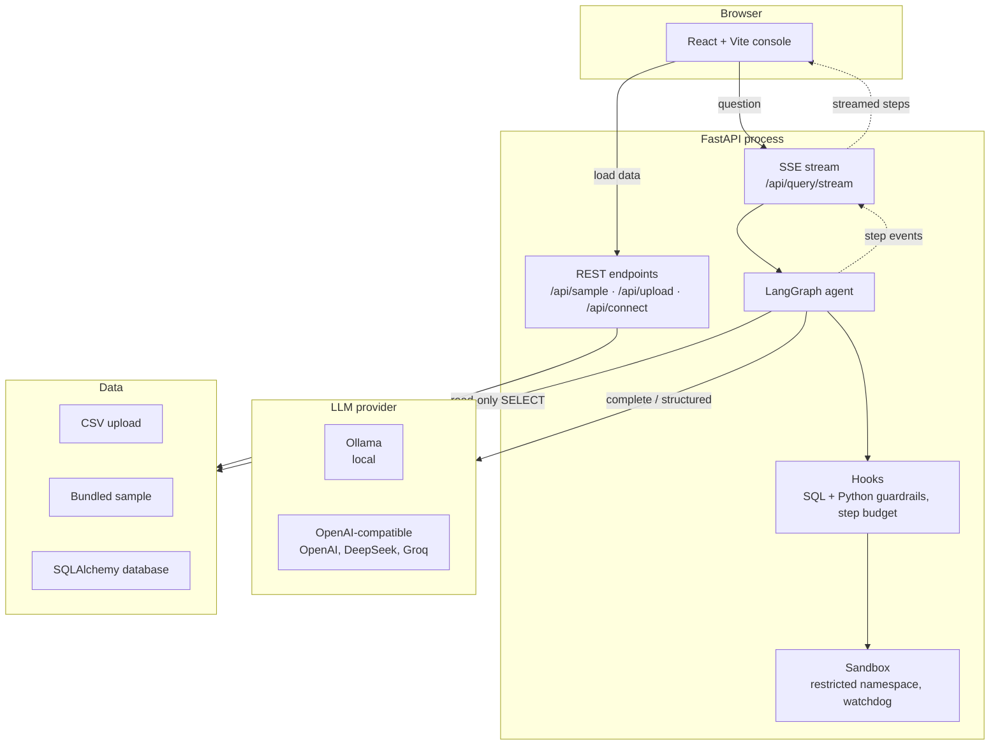
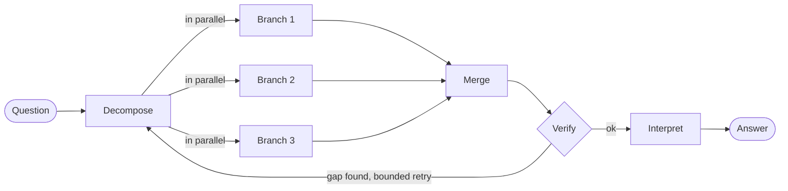

# Prism

Ask a question about your data in plain English and Prism works out the answer. It splits the question into independent parts, runs them in parallel, checks its own results, and shows every step live while it works.


*"Revenue by region as a chart and revenue by category" becomes two tasks running at the same time. Sped up 3x.*

[](https://github.com/asadaslam556/prism-data-agent/actions/workflows/ci.yml)


By default everything runs on your own machine: the model (through [Ollama](https://ollama.com)), the database and the code sandbox. No API keys, and your data stays put. If you'd rather use a hosted model, one environment variable switches to OpenAI or any OpenAI-compatible endpoint, such as DeepSeek or Groq.


## What it does

1. **Load data.** Upload a CSV, connect a SQL database (Postgres, MySQL, SQLite), or use the bundled sample of 1,400 sales orders.

   

2. **Ask.** *"Which product has the highest average discount?"* or *"Show the monthly revenue trend as a chart."*
3. **Watch it work.** Each answer has a collapsible panel listing the steps the agent took. It streams while the run is going and folds away when it's done.
4. **Check the working.** You get the answer, plus the SQL it wrote, the result table, any pandas analysis and the chart.


Bar and line charts are redrawn as SVG in the browser, so you can hover to read exact values. Anything that can't be redrawn faithfully, like a pie or bubble chart, is shown as the image the agent produced.


## Quickstart

You need **Python 3.11+**, **Node 20.19+** and **[Ollama](https://ollama.com/download)**.

**1. Pull a model** (once):

```bash
ollama pull qwen2.5
```

Any tool-capable model works. Bigger models write better SQL; smaller ones lean harder on the retry and fallback logic.

**2. Start the backend** (terminal 1):

```bash
cd backend
python -m venv .venv
source .venv/bin/activate        # Windows: .venv\Scripts\Activate.ps1
pip install -r requirements.txt
uvicorn app.main:app --reload --port 8000
```

**3. Start the frontend** (terminal 2):

```bash
cd frontend
npm install
npm run dev
```

Open http://localhost:5173, click **Load sample dataset**, and try *"Show the monthly revenue trend as a chart"*. Then try *"Revenue by region as a chart and revenue by category"* to see it split into two tasks.

On Windows, [docs/windows.md](docs/windows.md) walks through the same steps in PowerShell.

### With Docker

```bash
docker compose up --build
docker compose exec ollama ollama pull qwen2.5   # once
```

Frontend on http://localhost:5173, API on port 8000, Ollama on 11434.

## Using a hosted model

Set `LLM_PROVIDER=openai` and a key, and restart the backend. The provider package is already in `requirements.txt`.

**OpenAI:**

```bash
export LLM_PROVIDER=openai
export OPENAI_API_KEY=sk-...
export LLM_MODEL=gpt-4o-mini
```

**DeepSeek**, or any other OpenAI-compatible service, uses the same provider with a different base URL:

```bash
export LLM_PROVIDER=openai
export OPENAI_API_KEY=sk-...
export OPENAI_BASE_URL=https://api.deepseek.com/v1
export LLM_MODEL=deepseek-v4-flash
export LLM_EXTRA_BODY='{"thinking": {"type": "disabled"}}'
```

Don't skip the last line. DeepSeek's V4 models run in thinking mode by default, and thinking mode rejects a forced tool choice (`400 Thinking mode does not support this tool_choice`). The planner, decomposer and verifier all rely on exactly that, so without it every question fails. Turning thinking off also makes runs noticeably faster.

A few more things worth knowing:

- `OPENAI_BASE_URL` points the provider at any compatible server: LM Studio, vLLM, Groq, a company gateway.
- Gateways often rename models (`gpt-4o-mini@default`, say). Run `python list_models.py` from `backend/` and it will list what your endpoint actually serves and tell you whether `LLM_MODEL` is on it.
- Some models reject `temperature` outright. Set `LLM_TEMPERATURE=` (blank) to leave it out of the request.
- The pill in the app header always shows which provider and model are answering.

If the backend can't reach the model (Ollama not running, bad key) you get a readable message saying what to check, not a stack trace.

## Configuration

Everything is an environment variable. Copy `backend/.env.example` to `backend/.env` and edit it. The file is read once at startup, so restart the server after changing it.

| Variable | Default | Purpose |
| --- | --- | --- |
| `LLM_PROVIDER` | `ollama` | `ollama` or `openai` (OpenAI or any compatible endpoint) |
| `LLM_MODEL` | provider default | Overrides the model for whichever provider is active |
| `LLM_TEMPERATURE` | `0.0` | Leave blank to omit it from the request |
| `LLM_TOP_P` | | Nucleus sampling. Blank leaves it to the provider |
| `LLM_MAX_TOKENS` | `2048` | Ceiling on what the model may write per call |
| `LLM_REQUEST_TIMEOUT` | `180` | Seconds per call. One question is several calls |
| `LLM_EXTRA_BODY` | | Raw JSON merged into the request, for provider-specific switches like thinking mode |
| `OPENAI_API_KEY` | | Only for the hosted provider |
| `OPENAI_BASE_URL` | | Point at DeepSeek, Groq, a gateway or any compatible server |
| `OLLAMA_BASE_URL` | `http://localhost:11434` | Where Ollama listens |
| `OLLAMA_MODEL` | `qwen2.5` | Ollama's default model |
| `MAX_AGENT_STEPS` | `16` | Hard cap on planner steps, shared across all branches |
| `MAX_PARALLEL_BRANCHES` | `3` | Sub-questions run at once. `1` gives the plain single loop |
| `MAX_VERIFY_PASSES` | `1` | How often the verifier may send work back |
| `ENABLE_VERIFIER` | `true` | Turns the verification step off entirely |
| `MAX_SQL_ROWS` | `1000` | Row cap on every generated query |
| `SQL_RETRY_ATTEMPTS` | `1` | Extra tries after a failed query |
| `SANDBOX_TIMEOUT_SECONDS` | `30` | Wall-clock cap on one generated snippet |
| `MAX_UPLOAD_MB` | `25` | Upload size cap |
| `MAX_SESSIONS` / `SESSION_TTL_MINUTES` | `24` / `120` | How many datasets stay loaded, and for how long |
| `LOG_LEVEL` | `INFO` | App log verbosity |
| `APP_USERNAME` / `APP_PASSWORD` | | Set both to put the whole app behind a browser login |
| `ENABLE_DB_CONNECT` | `true` | Turns `/api/connect` off. The deployment image sets it to `false` |

## Architecture

One React app, one FastAPI process, one agent. The model provider and the data source are both swappable, and neither the agent nor the UI cares which one is active.



The agent has two levels, both explicit [LangGraph](https://langchain-ai.github.io/langgraph/) state machines. The **orchestrator** decides how many independent sub-questions a request contains, runs a **worker** for each at the same time, merges the results, and passes them to a **verifier** that can send the work back for another pass.



Each branch runs its own plan-act loop with isolated state:


Most questions decompose to a single branch and behave like a plain agent loop. The parallel machinery only kicks in when a question really has independent parts.

The code follows the same split:

| Directory | What lives there |
| --- | --- |
| `backend/app/agent/` | Both graphs, their state, the prompts, and the provider layer |
| `backend/app/skills/` | One module per capability (SQL, pandas, chart, final answer), each returning a `SkillResult` |
| `backend/app/hooks/` | Guardrails around every step: SQL and Python validation, the step budget, logging |
| `backend/app/services/` | Dataset sessions and the execution sandbox |
| `backend/app/data/` | SQLAlchemy engines and schema introspection |

[docs/architecture.md](docs/architecture.md) goes into the state design, streaming and the trade-offs. [docs/guide.md](docs/guide.md) walks through every file and follows a question from the browser to the answer.

## Security model

Running SQL and Python that a model wrote is the main risk in this project, so everything the model writes goes through several independent layers:

1. **Static checks.** SQL must be a single `SELECT` or `WITH` statement with no write or admin keywords, and its row count is capped. Python is parsed and walked before it runs: no imports, no private or dunder attributes, no frame introspection, no `eval`/`exec`/`open`, and none of the pandas or numpy calls that read or write files.
2. **A restricted namespace.** Snippets see a copy of the data, about twenty allow-listed builtins, and read-only views of pandas, numpy and pyplot that refuse to hand out other modules, since those libraries import `os` and `subprocess` internally.
3. **A runtime backstop.** While a snippet runs, an audit hook refuses file writes, process creation and network access, however the call was reached.
4. **A watchdog.** Snippets are stopped after `SANDBOX_TIMEOUT_SECONDS`, which catches the `while True:` loop no static check can.
5. **A bounded loop.** A step budget shared across branches, and a cap on verifier retries.

This is hardening for a local, single-user tool, not a jail. CPython can't be fully locked down from inside its own process. [SECURITY.md](SECURITY.md) lists the known gaps and what a multi-tenant deployment would need on top.

## Deployment

The root `Dockerfile` builds a single image: the React app is served by FastAPI, so there is one process and one port. It listens on `$PORT` when the host sets one. [docs/deploy-render.md](docs/deploy-render.md) is a step-by-step guide for putting it on Render's free tier behind a login.

## Testing

```bash
cd backend
pip install -r requirements-dev.txt
python -m pytest
ruff check app tests list_models.py
```

The model is mocked in every test, so the suite runs anywhere, CI included, without Ollama. It covers everything around the model: both guardrails and the known sandbox escape routes, the data layer and API, the worker loop and its fallbacks, the orchestration layer (decomposition, real thread-level parallelism, verifier retries), provider selection and outage handling, and the concurrency bugs that only appeared once branches ran at the same time.

## Project structure

```
prism-data-agent/
├── backend/
│   ├── app/
│   │   ├── agent/          # graphs, state, prompts, LLM provider layer
│   │   ├── skills/         # sql, python, chart, interpret
│   │   ├── hooks/          # guardrails, step budget, logging
│   │   ├── services/       # dataset sessions, execution sandbox
│   │   ├── data/           # SQLAlchemy connectors
│   │   ├── config.py       # settings, all overridable by env var
│   │   ├── schemas.py      # API models
│   │   └── main.py         # FastAPI app and SSE endpoint
│   ├── data/samples/       # the bundled sales dataset
│   ├── tests/
│   ├── list_models.py      # asks the configured endpoint what it serves
│   ├── Dockerfile          # backend image for docker-compose
│   └── requirements*.txt
├── frontend/               # React + Vite console
├── docs/                   # architecture, walkthrough, Windows and Render guides
├── Dockerfile              # single deployment image
└── docker-compose.yml      # Ollama + backend + frontend for local use
```

## Extending it

To add a capability, say forecasting:

1. Create `backend/app/skills/forecast_skill.py` exposing `NAME`, `DESCRIPTION` and `run(...) -> SkillResult`.
2. Add a node and a loop-back edge for it in `backend/app/agent/graph.py`, and add the action to the planner prompt.
3. The reasoning panel picks it up from the streamed steps with no frontend change.

A new LLM provider is one function in `backend/app/agent/providers.py` with `@register("name")` on it.

## Roadmap

- Keep intermediate DataFrames across a conversation so follow-ups don't re-query
- Dependent sub-questions, where one branch feeds another
- Multiple tables and joins
- Result caching keyed on question and schema
- Export a run as a notebook

## Contributing

See [CONTRIBUTING.md](CONTRIBUTING.md). Changes are listed in [CHANGELOG.md](CHANGELOG.md).

## License

[MIT](LICENSE) © Asad Aslam
