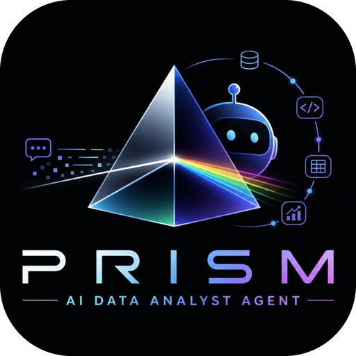
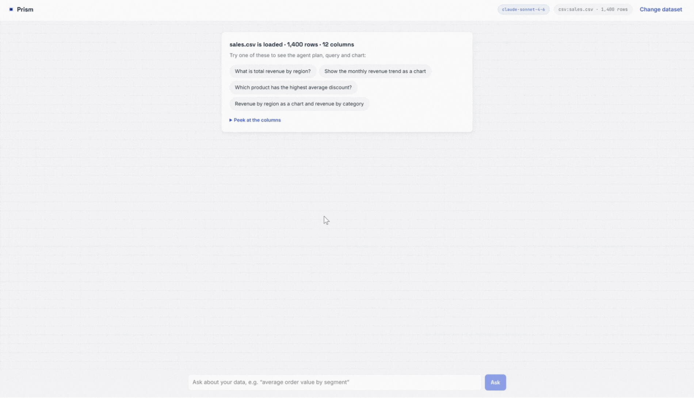
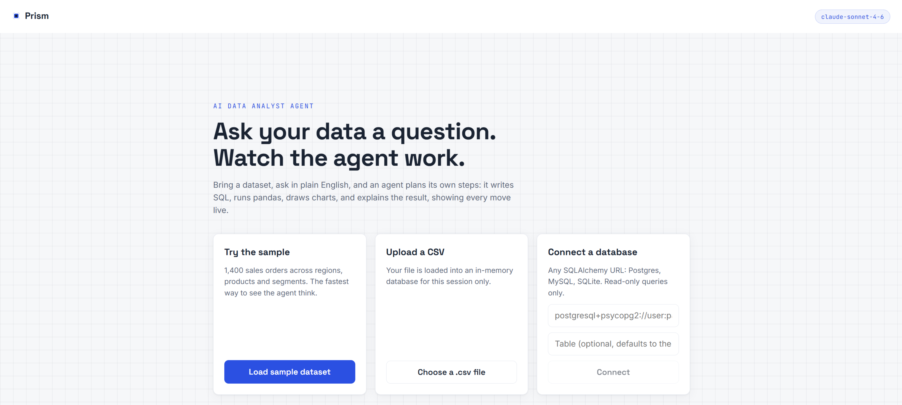
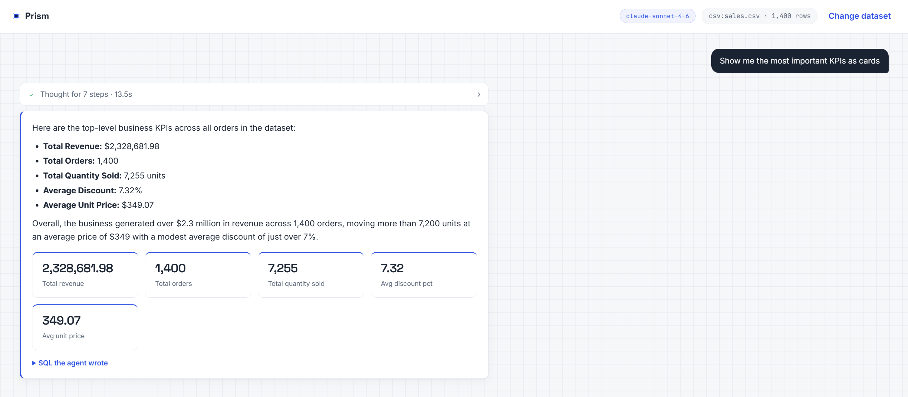
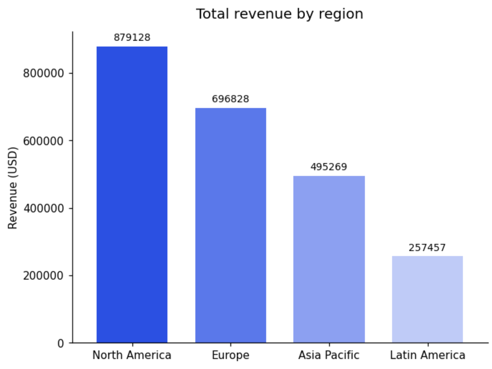

<p align="center">
  <picture>
    <source media="(prefers-color-scheme: dark)" srcset="docs/images/logo-dark.png">
    
  </picture>
</p>

<h1 align="center">Prism</h1>

<p align="center">
  <strong>Ask your data questions in plain English.</strong><br>
  A LangGraph agent splits the question up, writes the SQL, runs pandas, draws the charts<br>
  and checks its own answer, showing every step live while it works.
</p>

<p align="center">
  <a href="https://github.com/asadaslam556/prism-data-agent/actions/workflows/ci.yml"></a>
  <a href="https://github.com/asadaslam556/prism-data-agent/security/code-scanning"></a>
  
  
  <a href="LICENSE"></a>
</p>

<p align="center">
  <a href="#quickstart">Quickstart</a> ·
  <a href="#architecture">Architecture</a> ·
  <a href="#security-model">Security</a> ·
  <a href="docs/README.md">Docs</a> ·
  <a href="CHANGELOG.md">Changelog</a>
</p>

<p align="center">
  
  <br>
  <em>One session on the bundled sample: a simple question, a monthly trend as a line chart, a two-part question that runs as parallel tasks, and KPI cards.</em>
</p>

---

## Contents

- [Highlights](#highlights)
- [What it looks like](#what-it-looks-like)
- [Tech stack](#tech-stack)
- [Quickstart](#quickstart)
- [Using a hosted model](#using-a-hosted-model)
- [Usage](#usage)
- [Configuration](#configuration)
- [Architecture](#architecture)
- [Security model](#security-model)
- [Deployment](#deployment)
- [Testing](#testing)
- [Project structure](#project-structure)
- [Troubleshooting](#troubleshooting)
- [Extending it](#extending-it)
- [Roadmap](#roadmap)
- [Documentation](#documentation)
- [License](#license)

## Highlights

- **Runs on your machine.** The model (through [Ollama](https://ollama.com)), the database and the code sandbox all stay local. No API keys, and your data never leaves the box.
- **Parallel by design.** A question with independent parts is split into separate agent loops that run at the same time, then merged.
- **Checks its own work.** A separate verifier looks at the merged results and can send the work back for another pass.
- **Shows its reasoning.** Every step streams to the browser as it happens, and folds away once the answer arrives.
- **Safe to point at real data.** Generated SQL is read-only and row-capped; generated Python runs in a sandbox with static checks, restricted modules, a runtime audit hook and a watchdog.
- **Swappable model.** One environment variable moves from Ollama to OpenAI or any OpenAI-compatible service, such as DeepSeek or Groq.

## What it looks like

| Load data | Get a grounded answer |
| :---: | :---: |
|  |  |
| Upload a CSV, connect Postgres, MySQL or SQLite, or use the bundled 1,400-order sample. | The answer, plus the SQL it wrote, the result table, any pandas analysis and the chart. |

| The agent graph | A chart it drew |
| :---: | :---: |
|  |  |
| Decompose, fan out, merge, verify, answer. | Bar and line charts are redrawn as SVG with hover values; anything else is shown as drawn. |

## Tech stack

<p align="center">
  
</p>

| Layer | Built with | Why |
| --- | --- | --- |
| Frontend |   | A small console with no runtime dependencies beyond React. Charts and markdown are drawn by hand. |
| API |   | REST endpoints plus a Server-Sent Events stream for live steps. |
| Agent |   | Two explicit state graphs: an orchestrator and a worker loop. |
| Models |    | Local by default, hosted with one variable. |
| Analysis |    | The sandboxed analysis and charting environment. |
| Data |    | Every dataset sits behind one SQLAlchemy engine, whatever its source. |
| Quality |    | Tests with the model mocked, linting, and code scanning on every push. |
| Delivery |    | One deployment image, CI on Python 3.11 and 3.12, hosted on Render. |

## Quickstart

You need **Python 3.11+**, **Node 20.19+** and **[Ollama](https://ollama.com/download)**.


**1. Pull a model** (once):

```bash
ollama pull qwen2.5
```

Any tool-capable model works. Bigger models write better SQL; smaller ones lean harder on the retry and fallback logic.

**2. Start the backend** (terminal 1):

```bash
cd backend
python -m venv .venv
source .venv/bin/activate        # Windows: .venv\Scripts\Activate.ps1
pip install -r requirements.txt
uvicorn app.main:app --reload --port 8000
```

**3. Start the frontend** (terminal 2):

```bash
cd frontend
npm install
npm run dev
```

Open http://localhost:5173 and click **Load sample dataset**. The Vite dev server proxies `/api` to port 8000, so keep the backend there.

On Windows, [docs/windows.md](docs/windows.md) walks through the same steps in PowerShell.

<details>
<summary><strong>Or run everything with Docker</strong></summary>

```bash
docker compose up --build
docker compose exec ollama ollama pull qwen2.5   # once
```

Frontend on http://localhost:5173, API on port 8000, Ollama on 11434. This stack always runs on Ollama; see [docs/deployment.md](docs/deployment.md) for the single-image option.

</details>

## Using a hosted model

Set `LLM_PROVIDER=openai` and a key, then restart the backend. The provider package is already in `requirements.txt`.

**OpenAI:**

```bash
export LLM_PROVIDER=openai
export OPENAI_API_KEY=<YOUR_API_KEY>
export LLM_MODEL=gpt-4o-mini
```

**DeepSeek**, or any other OpenAI-compatible service, uses the same provider with a different base URL:

```bash
export LLM_PROVIDER=openai
export OPENAI_API_KEY=<YOUR_API_KEY>
export OPENAI_BASE_URL=https://api.deepseek.com/v1
export LLM_MODEL=deepseek-v4-flash
export LLM_EXTRA_BODY='{"thinking": {"type": "disabled"}}'
```

> [!IMPORTANT]
> Don't skip the last line. DeepSeek's V4 models run in thinking mode by default, and thinking mode rejects a forced tool choice (`400 Thinking mode does not support this tool_choice`). The planner, decomposer and verifier all rely on exactly that, so without it every question fails. Turning thinking off also makes runs faster.

- `OPENAI_BASE_URL` points the provider at any compatible server: LM Studio, vLLM, Groq, a company gateway.
- Gateways often rename models (`gpt-4o-mini@default`, say). Run `python list_models.py` from `backend/` to list what your endpoint serves.
- Some models reject `temperature`. Set `LLM_TEMPERATURE=` (blank) to leave it out of the request.
- The pill in the app header shows which model is answering.

If the backend can't reach the model (Ollama not running, a bad key) you get a readable message saying what to check, not a stack trace. More in [docs/models.md](docs/models.md).

## Usage

Load the sample, then try:

| Ask | What you'll see |
| --- | --- |
| *What is total revenue by region?* | One query, a table and a short answer |
| *Show the monthly revenue trend as a chart* | A query and a chart; bar and line charts are redrawn from the rows |
| *Revenue by region as a chart and revenue by category* | Two branches running at the same time, one per part |
| *Total revenue, average order value and order count* | A single-row result shown as KPI cards |

Each answer comes with the SQL the agent wrote, the result table, any pandas code it ran, and a collapsible panel with every step it took.

The same agent is available over HTTP:

```bash
# load the sample and keep its session id
curl -s http://localhost:8000/api/sample

# ask a question in one request
curl -s http://localhost:8000/api/query \
  -H "Content-Type: application/json" \
  -d '{"session_id": "<SESSION_ID>", "question": "What is total revenue by region?"}'
```

`POST /api/query/stream` streams the same run as Server-Sent Events. Every route is in [docs/api.md](docs/api.md).

## Configuration

Everything is an environment variable. Copy `backend/.env.example` to `backend/.env` and edit it; the file is read once at startup, so restart the server after a change. Defaults and details for every setting are in [docs/configuration.md](docs/configuration.md).

| Variable | Purpose |
| --- | --- |
| `LLM_PROVIDER` | `ollama` or `openai` (OpenAI or any compatible endpoint) |
| `LLM_MODEL` | Model for the active provider |
| `LLM_TEMPERATURE`, `LLM_TOP_P`, `LLM_MAX_TOKENS` | Sampling and length; blank leaves temperature and top-p out |
| `LLM_REQUEST_TIMEOUT` | Seconds per model call |
| `LLM_EXTRA_BODY` | Raw JSON merged into the request, for switches like DeepSeek's thinking mode |
| `OPENAI_API_KEY`, `OPENAI_BASE_URL` | The hosted provider's key and endpoint |
| `OLLAMA_BASE_URL`, `OLLAMA_MODEL` | Where Ollama listens, and its model |
| `MAX_AGENT_STEPS` | Planner steps, shared by all branches of one question |
| `MAX_PARALLEL_BRANCHES` | Sub-questions run at once; `1` gives a single loop |
| `MAX_VERIFY_PASSES`, `ENABLE_VERIFIER` | How often the verifier may send work back, or turn it off |
| `MAX_SQL_ROWS`, `SQL_RETRY_ATTEMPTS` | Row cap on every query, and retries after a failed one |
| `SANDBOX_TIMEOUT_SECONDS` | Wall-clock cap on one generated snippet |
| `MAX_UPLOAD_MB`, `MAX_SESSIONS`, `SESSION_TTL_MINUTES` | Upload size, datasets kept loaded, and for how long |
| `APP_USERNAME`, `APP_PASSWORD` | Set both to put the whole app behind a browser login |
| `ENABLE_DB_CONNECT` | Allows `/api/connect`; the deployment image turns it off |
| `CORS_ORIGINS` | Origins allowed to call the API from another host |
| `LOG_LEVEL` | App log level |

## Architecture

One React app, one FastAPI process, one agent. The model provider and the data source are both swappable.

<a href="docs/diagrams/system-overview.architecture.html"></a>

The question is split into independent parts by an **orchestrator** graph, and each part runs its own **plan-act loop** at the same time:

| Orchestrator | Branch loop |
| :---: | :---: |
|  |  |

Every step streams to the browser as it finishes:


[docs/architecture.md](docs/architecture.md) walks through all 21 diagrams. Each one also has an interactive version (`.html` next to the image in [docs/diagrams/](docs/diagrams/)) with search, focus and light and dark themes; in the code-level architecture diagrams, components link to their source lines.

## Security model

Running SQL and Python that a model wrote is the main risk here, so everything it writes passes through independent layers.


This is hardening for a local, single-user tool, not a jail. CPython can't be fully locked down from inside its own process. [SECURITY.md](SECURITY.md) lists the known gaps and how to report a vulnerability; [docs/guardrails.md](docs/guardrails.md) covers each layer.

## Deployment



The root `Dockerfile` builds one image: FastAPI serves the built React app and the API on one port (`$PORT`, 7860 by default), with `/api/connect` turned off. [docs/deployment.md](docs/deployment.md) compares the three setups, and [docs/deploy-render.md](docs/deploy-render.md) puts the image on Render's free tier behind a login.

## Testing

```bash
cd backend
pip install -r requirements-dev.txt
python -m pytest
ruff check app tests list_models.py
```

The model is mocked in every test, so the suite runs anywhere, CI included, without Ollama. It covers:

- both guardrails, and every sandbox escape route found so far
- the data layer, the API and the server limits
- the worker loop, its fallbacks and the step budget
- the orchestration layer: decomposition, real thread-level parallelism, verifier retries
- provider selection and outage handling
- the concurrency bugs that only appeared once branches ran at the same time

CI runs the same checks on Python 3.11 and 3.12, builds the frontend and builds the deployment image; see [CONTRIBUTING.md](CONTRIBUTING.md).

## Project structure

```
prism-data-agent/
├── backend/
│   ├── app/
│   │   ├── agent/          # graphs, state, prompts, model providers
│   │   ├── skills/         # sql, python, chart, interpret
│   │   ├── hooks/          # guardrails, step budget, logging
│   │   ├── services/       # dataset sessions, execution sandbox
│   │   ├── data/           # SQLAlchemy connectors
│   │   ├── config.py       # settings, all overridable by env var
│   │   ├── schemas.py      # API models
│   │   └── main.py         # FastAPI app, middleware and routes
│   ├── data/samples/       # the bundled sales dataset
│   ├── tests/
│   ├── list_models.py      # asks the configured endpoint what it serves
│   ├── Dockerfile          # backend image for docker-compose
│   └── requirements*.txt
├── frontend/               # React + Vite console
├── docs/
│   ├── diagrams/           # archify sources (.json), interactive .html, .svg and .png
│   ├── images/             # screenshots, demo and logo
│   └── archive/            # superseded pages, kept for history
├── Dockerfile              # single deployment image
└── docker-compose.yml      # Ollama + backend + frontend for local use
```

## Troubleshooting

| Symptom | Fix |
| --- | --- |
| Answers fail with connection errors to port 11434 | Ollama isn't running. Start it, or run `ollama serve`. |
| "Not Found" when loading the sample | Something else is listening on port 8000. Stop it; the frontend always proxies to 8000. |
| A changed `.env` setting has no effect | It's read once at startup. Restart the backend. |
| DeepSeek fails with `Thinking mode does not support this tool_choice` | Set `LLM_EXTRA_BODY={"thinking": {"type": "disabled"}}`. |

More in [docs/troubleshooting.md](docs/troubleshooting.md).

## Extending it

To add a capability, say forecasting:

1. Create `backend/app/skills/forecast_skill.py` exposing `NAME`, `DESCRIPTION` and `run(...) -> SkillResult`.
2. In `backend/app/agent/graph.py`, add the action to the `Action` type, add a node with a loop-back edge to `plan`, and map it in `branch_route`.
3. Describe the action in `PLANNER_SYSTEM` in `backend/app/agent/prompts.py`.
4. Add the node name to `TraceStep.node` in `backend/app/schemas.py`, or `/api/query` rejects the new step.

The reasoning panel picks the new steps up with no frontend change. A new model provider is one function in `backend/app/agent/providers.py` with `@register("name")` on it.

## Roadmap

- [ ] Keep intermediate DataFrames across a conversation so follow-ups don't re-query
- [ ] Dependent sub-questions, where one branch feeds another
- [ ] Multiple tables and joins
- [ ] Result caching keyed on question and schema
- [ ] Export a run as a notebook

## Documentation

Start at [docs/README.md](docs/README.md), which maps every page.

| Document | What's in it |
| --- | --- |
| [docs/architecture.md](docs/architecture.md) | Every diagram, explained |
| [docs/agent.md](docs/agent.md) | The orchestrator, the branch loop, the planner, streaming |
| [docs/data.md](docs/data.md) | Loading data, sessions, where the numbers come from, concurrency |
| [docs/guardrails.md](docs/guardrails.md) | The SQL guard and the Python sandbox |
| [docs/configuration.md](docs/configuration.md) | Every setting, with defaults |
| [docs/api.md](docs/api.md) | Every route and the streaming format |
| [docs/deployment.md](docs/deployment.md) | Local, compose and single-image setups, and CI |
| [SECURITY.md](SECURITY.md) | Known gaps and how to report a vulnerability |
| [CONTRIBUTING.md](CONTRIBUTING.md) | Setup for contributors, checks, and where things go |

## License

Built and maintained by **Asad Aslam** · [GitHub](https://github.com/asadaslam556) · [asadaslam.tech](https://asadaslam.tech/)

Released under the [MIT License](LICENSE).
