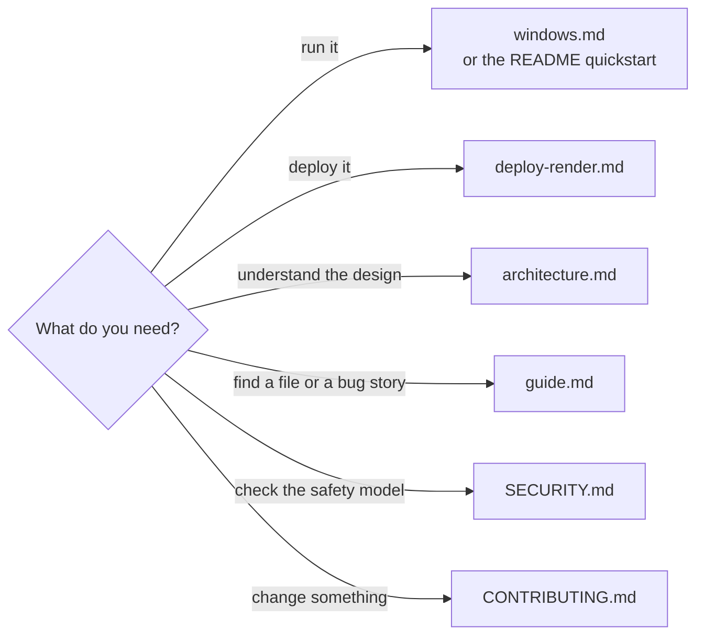

# Prism documentation

Everything beyond the [main README](../README.md), grouped by what you're trying to do.

## Using Prism

| Guide | Read it when |
| --- | --- |
| [Quickstart](../README.md#quickstart) | You're on macOS or Linux and want it running in five minutes |
| [Running on Windows](windows.md) | You're on Windows, or something in PowerShell isn't behaving |
| [Using a hosted model](../README.md#using-a-hosted-model) | You'd rather use OpenAI, DeepSeek or another compatible API than Ollama |
| [Configuration](../README.md#configuration) | You want the full list of settings |
| [Deploying to Render](deploy-render.md) | You want it on a public URL behind a login |

## How it works

| Document | What's in it |
| --- | --- |
| [Architecture](architecture.md) | The two graphs, state and reducers, concurrency, planner fallbacks, streaming, providers |
| [Project guide](guide.md) | Every file and what it does, the life of a question, the bugs that shaped the design, troubleshooting |
| [Security](../SECURITY.md) | The five sandbox layers, known gaps, and how to report a vulnerability |

## Working on it

| Document | What's in it |
| --- | --- |
| [Contributing](../CONTRIBUTING.md) | Setup, the checks CI runs, where new code goes |
| [Changelog](../CHANGELOG.md) | What changed in each version |
| [Code of Conduct](../CODE_OF_CONDUCT.md) | How we treat each other here |

## Images

The screenshots and the demo in `images/` come from real runs against the bundled sample dataset.

| File | Shows |
| --- | --- |
| `demo.gif` | A two-part question splitting into parallel tasks |
| `agent-graph.png` | The orchestrator and worker graphs |
| `getting-started.png` | The three ways to load data |
| `kpi-cards.png` | A finished answer with KPI cards |
| `revenue-by-region.png` | A chart the agent drew |
