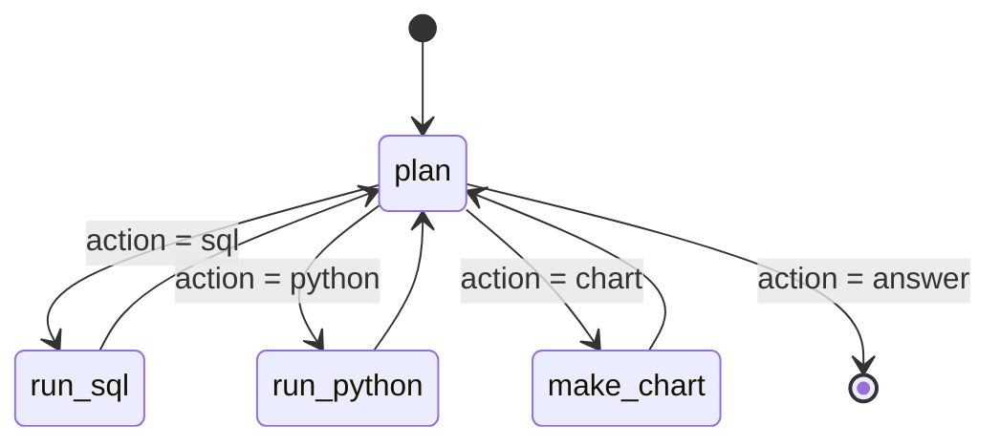
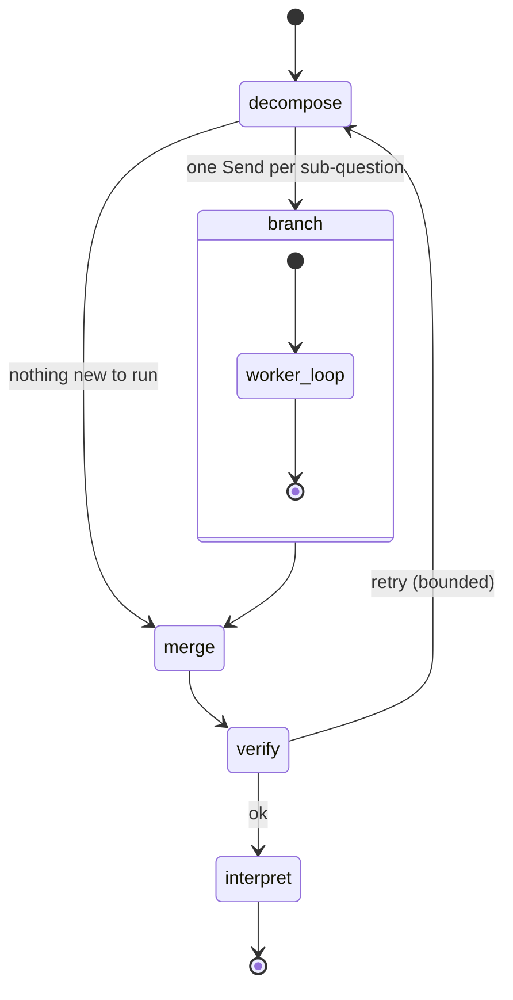
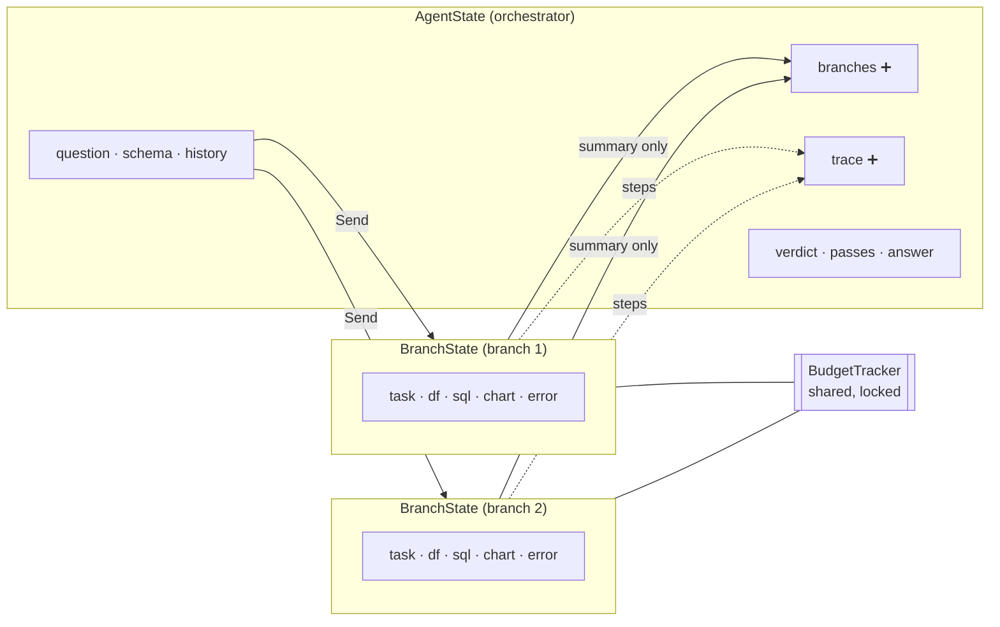
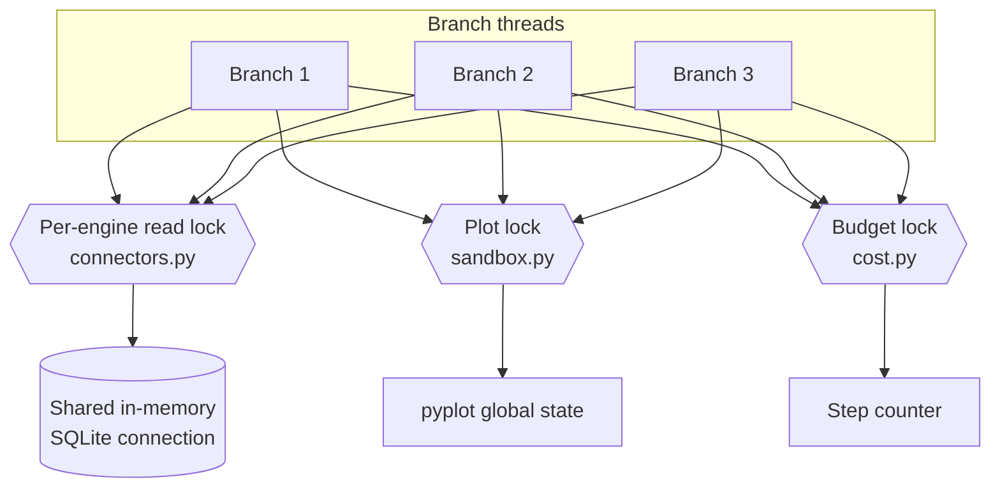
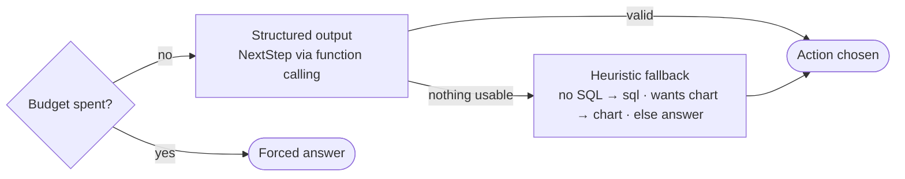
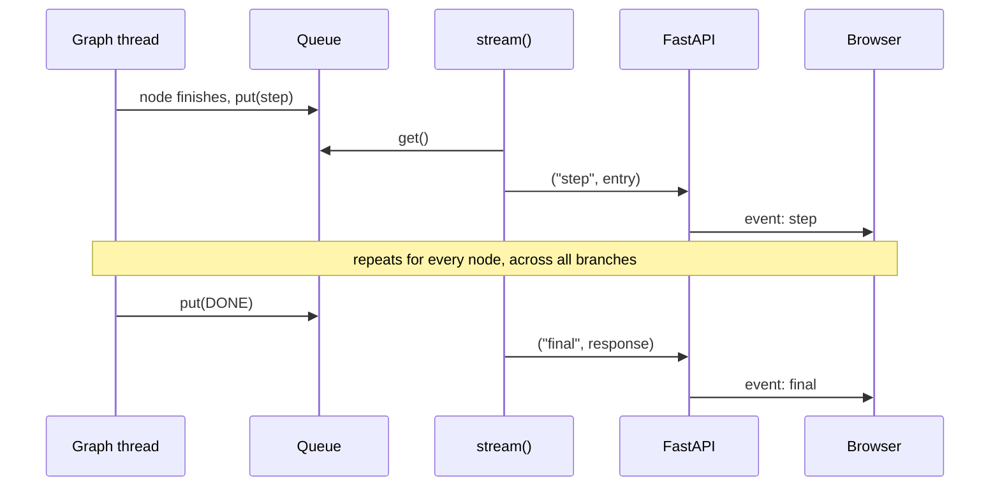
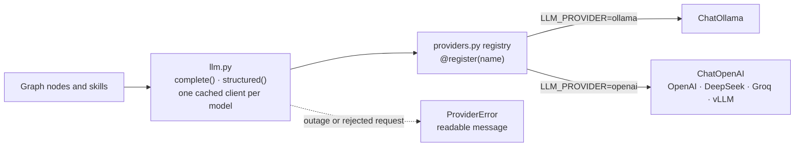
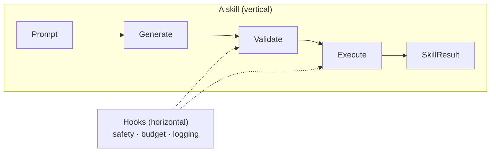

# Architecture

How the agent works inside and why it's built this way. The [README](../README.md) covers what it does; [guide.md](guide.md) goes file by file.

**On this page:** [Two graphs](#two-graphs-not-one) · [State](#state) · [Concurrency](#what-parallelism-broke) · [Planner fallbacks](#the-planners-safety-nets) · [Safety layers](#safety-layering) · [Streaming](#streaming) · [Providers](#the-provider-layer) · [Skills and hooks](#skills-and-hooks) · [Testing](#testing-approach)

## Two graphs, not one

The agent is built from explicit LangGraph `StateGraph`s rather than a prebuilt ReAct helper. That costs some code and buys three things: the control flow is visible and testable, the routing is deterministic, and the steps the UI shows are the actual execution path rather than a reconstruction of it.

### The worker graph

The plan-act loop for a single sub-question:

Each time `plan` runs it looks at what the branch has so far (the SQL preview, any pandas output, whether a chart exists, the last error) and picks exactly one next action through structured output. Tool nodes always come back to `plan`. That edge is what lets a branch notice "the SQL is enough, but a chart was asked for" and take another step, or see an error and route around it.

### The orchestrator graph

Runs several of those loops:

`decompose` decides how many independent sub-questions the request contains, usually one. `fan_out` emits one `Send` per sub-question, and LangGraph runs them concurrently on separate threads. `merge` is the join point; the reducer has already collected the branch summaries by the time it runs. `verify` takes a second look at the merged results and can route back to `decompose` a bounded number of times.

Why two levels? Independent sub-questions get answered at the same time instead of one after another, which is what you notice with a slow local model. And the verifier is a separate node looking at the merged result, rather than the planner that did the work marking its own homework.

## State

➕ marks the fields with an additive reducer.

Each worker runs on its own `BranchState`: its sub-question, its working DataFrame, its errors. Nothing it does can reach another branch, and only a short summary crosses back to the orchestrator. That isolation is what makes the parallelism safe. One shared `df` field with last-write-wins would have three branches overwriting each other's data mid-run.

The fields several branches write at the same time, `branches` and `trace`, are declared with an additive reducer (`Annotated[list[dict], operator.add]`), so parallel updates append rather than fight over the slot. Everything else is last-write-wins, which is right for a field with a single owner.

The step budget is the deliberate exception to isolation. One `BudgetTracker` is shared by every branch, so the cap is on total work, not per branch. Several threads increment the same counter, so it has a lock.

The DataFrame travels through state as a real object and is never serialised mid-run; only the final response turns rows into JSON. That keeps the pandas and chart skills fast. The trade-off is that state can't be checkpointed to disk as-is, which is fine for a request-scoped agent and would be the first thing to change if runs ever needed to be resumable.

## What parallelism broke

Real threads surfaced bugs the sequential version could never hit, and each one now has a lock in exactly one place:

The worst was silent. The in-memory SQLite engines share one connection across threads, which is what makes an uploaded table visible to FastAPI's threadpool at all. Concurrent reads through that connection interleaved their cursors and returned each other's rows: no exception, just wrong numbers. Reads on shared-connection engines are now serialised per engine, while real databases, with a connection per thread, still run concurrently. SQLite queries take milliseconds and the model calls around them take seconds, so the parallelism that matters is kept.

pyplot's global figure state deadlocked two branches drawing at once, and `steps += 1` lost updates across threads. The details are in [guide.md](guide.md#bugs-found-along-the-way).

## The planner's safety nets

Structured output from a small local model fails in ways a large hosted model rarely does, so the planner degrades in stages:

1. **Structured output.** `with_structured_output(NextStep, method="function_calling")` returns a validated decision: an `action` and a one-sentence `reasoning` that the UI shows. Function calling is used on every provider because DeepSeek rejects the `json_schema` response format LangChain would otherwise pick.
2. **Heuristic fallback.** If that returns nothing usable, a fixed rule routes instead.
3. **The budget.** At `MAX_AGENT_STEPS` the action is forced to `answer`, so even a pathological loop ends with a best-effort answer instead of hanging. The graph's `recursion_limit` sits above the budget so the budget, with its graceful ending, always fires first.

## Safety layering

Generated code passes through independent layers, so getting past one still hits the next:

| Layer | SQL | Python |
| --- | --- | --- |
| Static checks | `sqlparse`: one statement, `SELECT`/`WITH` only, token-level keyword blocklist, comments stripped, trailing `LIMIT` added or clamped | AST walk: no imports, private or dunder attributes, frame introspection, `eval`/`exec`/`open`/`getattr`, or file-touching library calls |
| Constrained execution | read-only queries, row cap | a copied DataFrame, ~20 allow-listed builtins, module views that won't return submodules, an audit hook refusing writes, processes and sockets |
| Containment | the error goes back to the model for a retry, then fails gracefully | the watchdog stops runaway loops; errors go back to the planner, which can retry or answer without the analysis |

The SQL keyword check is token-level on purpose. A substring check would reject a `discount` column because it contains `count`. [SECURITY.md](../SECURITY.md) has the full picture, including the known gaps.

## Streaming

The graph runs on a background thread, and each node pushes its trace entry into a queue the moment it finishes. `stream()` drains the queue. Reading the parent state after each node instead would batch a branch's steps into one lump when that branch finished, which hides exactly the part worth seeing. With the queue, parallel branches report live and interleaved: two `plan` steps arrive back to back, then two `sql` steps. Each entry carries its branch id.

The API wraps each entry as an SSE `step` event and ends with one `final` event holding the full response. `EventSource` can't POST, so `api.js` reads the fetch body and parses the frames itself. If the connection closes before `final` arrives, the client reports an error instead of waiting forever. The reasoning panel is built entirely from those step objects; nothing about it is invented client-side.

## The provider layer

`providers.py` is a small registry. Each provider is one builder function tagged `@register("name")`, chosen at runtime by `LLM_PROVIDER`. `llm.py` puts `complete()` and `structured()` on top and caches one client per provider and model, so nothing else in the codebase knows which SDK is underneath. SDKs are imported inside their builders, so only the active one is loaded.

Failures fall into two groups. Transport, auth and configuration problems (connection refused, 401, unknown model, a rejected parameter) become a `ProviderError` with a message a person can act on, and `run()`/`stream()` turn it into a normal response, so an unreachable model shows up as a readable answer rather than a 500. Anything else, such as a model that can't produce structured output, falls through to the heuristic above.

## Skills and hooks

- A **skill** is a vertical capability: prompt → generate → validate → execute → `SkillResult`. Skills don't know about the graph; its nodes are thin adapters around them, which is what makes them easy to test with a mocked model.
- A **hook** is horizontal: safety, budget, logging. Skills and nodes import hooks directly rather than having them woven into the graph, so reading one skill shows its whole guardrail story.

## Testing approach

The model is mocked in every test. What's under test is everything around it: the guardrails, the sandbox, the data plumbing, and above all the control flow. Tools loop back to the planner, the fallback routes sensibly, the budget always ends the run, streaming emits steps and then exactly one final event. Those properties hold whichever model is plugged in. Model quality changes the answers; it shouldn't change whether the loop is safe.
