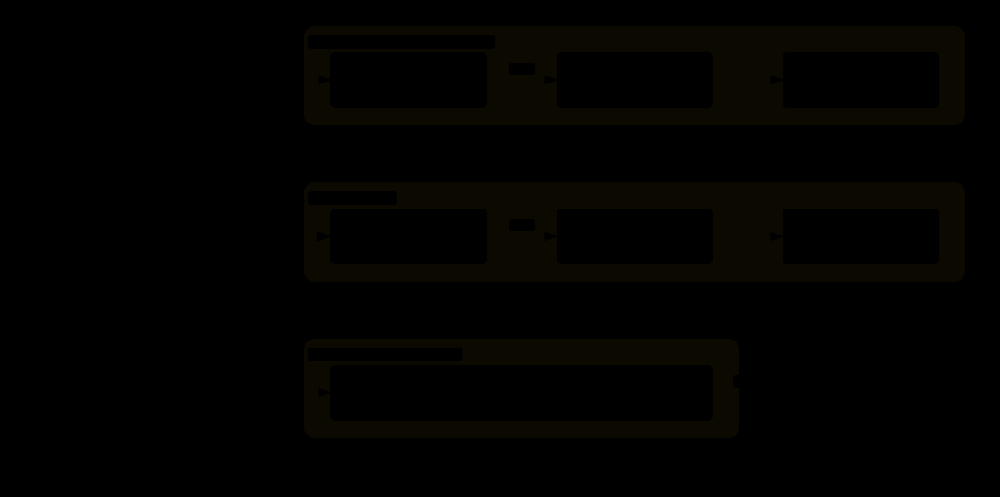

# Architecture

How Prism fits together: the system, the agent, the data, the model layer, the frontend and how it ships. The guardrails around generated code are in [SECURITY.md](../SECURITY.md); every setting is in [configuration.md](configuration.md).

**On this page:** [System](#system) · [The agent](#the-agent) · [A question end to end](#a-question-end-to-end) · [Data](#data) · [Models](#models) · [Frontend](#frontend) · [Running it](#running-it) · [Testing](#testing)

## System

One React app, one FastAPI process, one agent. Everything inside the dashed box runs in that single process: the API, the agent graph, the skills, the guardrails, the sandbox, the session registry, and the in-memory SQLite databases that hold uploaded CSVs. Only two things live outside it: the model provider, and your own database when you connect one.

The browser loads data over plain REST and asks questions over Server-Sent Events, so steps appear while the agent works.

### Backend modules

Arrows point from a module to what it imports, and nothing lower down imports back up. `main.py` knows the graph and the session registry; the graph drives the skills and asks the model layer for decisions; the skills use the guardrails, the sandbox and the connectors. `config.py`, which most modules read, is left out to keep the picture readable.

| Folder | Contents |
| --- | --- |
| `app/agent/` | The two graphs, their state, prompts, the model layer and providers |
| `app/skills/` | SQL, pandas, chart and final-answer capabilities |
| `app/hooks/` | SQL and Python guardrails, the step budget, logging |
| `app/services/` | Dataset sessions and the execution sandbox |
| `app/data/` | SQLAlchemy engines and schema introspection |

## The agent

The agent is two explicit LangGraph `StateGraph`s in `backend/app/agent/graph.py` rather than a prebuilt agent helper. The routing is deterministic, the steps the UI shows are the real execution path, and every edge is covered by a test with the model mocked.

### Orchestrator

The orchestrator (`build_graph`) runs `decompose → branch × N → merge → verify → interpret`.

**Decompose** asks the model for a `Decomposition`: a list of self-contained sub-questions, each with a `needs_chart` flag. Most questions come back as one; the prompt only allows a split when the parts are genuinely independent. The code then:

- **drops near-duplicates**: two sub-questions count as the same when, after removing filler words, at least 80% of the shorter one's keywords appear in the other. On a verifier retry, sub-questions already answered count too, so a reworded repeat isn't run and paid for twice;
- **caps the count** at `MAX_PARALLEL_BRANCHES` (default 3);
- **falls back** to the whole question as one task if the model's output isn't usable, flagging a chart when the question contains words like *chart*, *plot*, *trend* or *kpi*.

`fan_out` sends one `Send("branch", …)` per sub-question and LangGraph runs them at the same time. If a retry leaves nothing new to run, it routes straight to `merge`.

**Verify** asks the model whether the merged results answer the question (`ok` or `retry` plus a note). A `retry` goes back to `decompose` with the note as feedback, at most `MAX_VERIFY_PASSES` times (default 1). It returns `ok` without a model call when `ENABLE_VERIFIER` is off, the retries are used up or the budget is spent; with no results at all, or a reply that isn't a usable verdict, it also counts as `ok`.

**Interpret** writes the answer from a summary of every branch's results. The prompt tells the model to use only those numbers, describe the whole result, and never invent figures or claim a chart type that wasn't drawn.

### Branch loop

Each branch runs the plan-act loop on its own state:

| Node | Does |
| --- | --- |
| `plan` | Picks the single next action: `sql`, `python`, `chart` or `answer` |
| `run_sql` | Writes a query, validates it, runs it, retries with the error |
| `run_python` | Writes a pandas snippet, checks it, runs it in the sandbox |
| `make_chart` | Writes matplotlib code, checks it, runs it, returns a PNG |

Every tool hands control back to `plan`, which is what lets a branch notice "the query is done, but a chart was asked for" and take another step. `answer` ends the branch, and only a summary (task, SQL result, analysis, chart, error) goes back to the orchestrator.

### How plan decides

Small local models don't always manage structured output, so the planner degrades in stages:

1. It records a step. If the shared budget is spent, the action is `answer`.
2. Otherwise it asks for a `NextStep` (an action plus one sentence of reasoning, which the UI shows) through `llm.structured()`, which always uses function calling. DeepSeek rejects the JSON-schema response format LangChain would otherwise pick.
3. If nothing usable comes back, a fixed rule decides: no SQL yet → `sql`; a chart is owed and none exists → `chart`; otherwise → `answer`.

An outage or a rejected request is different: that raises `ProviderError` and ends the run with a readable message.

### State and the step budget

| State | Owner | Holds |
| --- | --- | --- |
| `AgentState` | Orchestrator | Question, schema, history, sub-tasks, the shared budget, the step queue, merged `branches`, verdict, answer, `trace` |
| `BranchState` | One branch | Its sub-question, its own DataFrame, SQL result, analysis, chart, last error, its `trace` |

Each branch works on its own state, so nothing it does can reach another branch. The two fields several branches write at once, `branches` and `trace`, use an additive reducer (`Annotated[list, operator.add]`), so parallel updates append instead of overwriting each other.

One `BudgetTracker` is shared by every branch, so `MAX_AGENT_STEPS` (default 16) caps the total work for a question, not each branch. LangGraph's own recursion limit is set above it (`(MAX_VERIFY_PASSES + 1) × 6 + MAX_AGENT_STEPS + 10` for the orchestrator, `MAX_AGENT_STEPS × 4 + 5` per branch), so the budget's graceful "answer now" always comes first.

### One question's lifecycle

| Ending | Cause | What the client gets |
| --- | --- | --- |
| Answered | The normal path | `event: final` with the answer, results and trace |
| Failed | A `ProviderError` from any model call, or the dataset session disappearing | `event: final` whose `error` field says what to check |
| Stopped | The client disconnected | Nothing; nobody is listening |
| Crashed | An unexpected bug | `event: error` with a generic message; details go to the server log |

## A question end to end

The browser posts the question. `graph.stream()` runs the graph on a background thread, and each node pushes its trace entry into a queue the moment it finishes; the API relays each one as an SSE `step` event, then sends one `final` event with the full response. Because the queue is written as work happens, parallel branches report live and interleaved instead of in one lump when a branch ends. `graph.run()` does the same without streaming, for `POST /api/query` and the tests.

| Trace `node` | Emitted by |
| --- | --- |
| `decompose`, `plan`, `merge`, `verify`, `interpret` | The node of the same name |
| `sql`, `python`, `chart` | A tool that succeeded |
| `retry` | A pandas or chart snippet that was rejected or failed |
| `error` | A failed SQL step, or a run that couldn't finish |

A step's `status` is `ok`, `retry` or `error`; the verifier sending work back is a `retry`.

### Stopping early

`POST /api/query/stream` creates a stop event. A watcher polls `request.is_disconnected()` every 0.5 seconds and sets it when the client leaves; the stream also sets it if it's closed before the end. A set stop event makes the budget read as spent, so each branch answers at its next step, the verifier skips its check, and `interpret` returns without a model call. A model call already in flight still finishes: a thread can be told to stop but not killed.

## Data

Code: `backend/app/data/connectors.py` and `backend/app/services/session.py`.

### Loading a dataset

| Source | Route | What happens |
| --- | --- | --- |
| Bundled sample | `GET /api/sample` | `sales.csv` is written into a new in-memory SQLite database |
| CSV or TSV upload | `POST /api/upload` | The same, from the uploaded file |
| Database URL | `POST /api/connect` | SQLAlchemy connects to your database; nothing is copied |

Every source ends up behind one SQLAlchemy engine, so the SQL skill never needs to know where the data came from. Uploads and the sample become a table named `data`; for a database URL, it's the table you name or the first one found. Loading reads the columns and types, `COUNT(*)` and five sample rows, and that schema goes into every prompt.

The in-memory engines use SQLAlchemy's `StaticPool`: one connection shared by every thread. Without it, each FastAPI worker thread would get its own empty database.

### Sessions

Each loaded dataset is a `DatasetSession` in an in-memory registry, keyed by a random 12-character id that the browser sends with every question.

- **Lookups refresh it**, updating its last-used time.
- **Too old:** idle longer than `SESSION_TTL_MINUTES` (default 120), it's dropped on the next lookup or load.
- **Too many:** past `MAX_SESSIONS` (default 24), the least recently used goes when a new one loads.
- **Dropping** disposes of the engine straight away. Later requests with that id get 404, and a question already running on it ends with a readable "that dataset is no longer loaded" answer.
- **A failed load** never creates a session; the API returns 400.

Sessions live in the process, so a restart clears them and several server processes would need a shared store.

### Where the numbers come from

1. The SQL skill runs a validated `SELECT` and gets at most `MAX_SQL_ROWS` rows (default 1000), marked `truncated` when it hits the cap.
2. The pandas and chart skills work on that result, or on the whole table if the branch has no query yet.
3. The pandas result becomes text capped at 4000 characters; a chart becomes a base64 PNG.
4. Rows go through pandas' own JSON encoder, so `NaN`, numpy types and timestamps become valid JSON.
5. The final answer is written from a summary of those results.

### Locks for parallel branches

| Lock | Where | Protects | Without it |
| --- | --- | --- | --- |
| Per-engine read lock | `connectors._read_guard` | The shared in-memory SQLite connection | Branches silently received each other's rows |
| Plot lock | `sandbox._PLOT_LOCK` | pyplot's global state, through PNG encoding | Two charts at once deadlocked the request |
| Budget lock | `BudgetTracker._lock` | The shared step counter | Steps went missing and the budget overran |
| Registry lock | `session._LOCK` | The session registry | Eviction could change it mid-iteration |

The read lock only applies to `StaticPool` engines; a real database gives each thread its own connection, so its queries still run concurrently. [design-notes.md](design-notes.md) has the bugs behind the first three.

### The sample dataset

`backend/data/samples/sales.csv` has 1,400 synthetic orders from January 2024 to October 2025, across 4 regions, 15 countries, 4 categories, 14 products and 3 customer segments. Twelve rows have an empty `sales_rep`. Columns: `order_id`, `order_date`, `region`, `country`, `category`, `product`, `customer_segment`, `sales_rep`, `quantity`, `unit_price`, `discount`, `revenue`.

## Models

Everything goes through `llm.py`, which offers `complete()` for text and `structured()` for a validated object, and keeps one client per provider and model. `providers.py` is a small registry: `LLM_PROVIDER` picks the builder, and only that provider's SDK is imported. The model has to support tool calling, because every structured call uses forced function calling.

| `LLM_PROVIDER` | Talks to | Needs |
| --- | --- | --- |
| `ollama` (default) | A local [Ollama](https://ollama.com) server at `OLLAMA_BASE_URL` | A pulled, tool-capable model |
| `openai` | OpenAI, or any OpenAI-compatible API at `OPENAI_BASE_URL`: DeepSeek, Groq, vLLM, LM Studio, a company gateway | `OPENAI_API_KEY` |

The model is `LLM_MODEL` if set, otherwise `OLLAMA_MODEL` or `OPENAI_MODEL` for the active provider, otherwise `qwen2.5` for Ollama and `gpt-4o-mini` for OpenAI. `/api/health` and the pill in the app header show the model actually in use.

| When a call fails | What Prism does |
| --- | --- |
| Connection refused, timeout, 401/403, rate limit, unknown model | Raises `ProviderError`; the run ends with a readable message in the final response, not a 500 |
| The endpoint rejected the request (400, 422, an unsupported parameter) | The same, with a hint about the setting to change, often `LLM_TEMPERATURE` or `LLM_MODEL` |
| The model answered without usable structured output | The caller falls back: the planner to its rule, the decomposer to the whole question, the verifier to `ok` |

Gateways often rename models, and a 404 doesn't say the right name. `python list_models.py` from `backend/` asks the configured endpoint for its models.

**Adding a provider** is one builder in `providers.py` with `@register("name")`, importing its SDK inside the function. Add its default to `DEFAULT_MODELS`, its model variable to `_MODEL_ENV_VARS` (and a matching `<name>_model` setting in `config.py`), and tests in `backend/tests/test_providers.py`.

## Frontend

A React 19 + Vite 8 console with no runtime dependencies beyond React. Code: `frontend/src`.

| File | Does |
| --- | --- |
| `App.jsx` | Owns the state: the dataset, the message feed, the live run and the model pill. Shows the landing screen until a dataset loads, then the chat |
| `api.js` | The only file that calls the backend. `streamQuery` reads Server-Sent Events from a `fetch` body, because `EventSource` can't POST |
| `DataUpload.jsx` | Load the sample, upload a CSV or TSV, or connect a database. The database card is hidden when `/api/health` reports `db_connect: false` |
| `ChatPanel.jsx` | The message feed, suggested questions and the input box |
| `AgentThinking.jsx` | The reasoning panel: open with a timer while the agent works, folded to "Thought for N steps" afterwards |
| `ResultView.jsx` | The answer, then each task's chart, a 10-row result table, and the generated SQL and Python |
| `DataChart.jsx` | Charts and KPI cards |
| `Markdown.jsx` | The answer's markdown, built as React elements so model text is never inserted as HTML |

Each question carries the last three question-and-answer pairs as `history`, so follow-ups like "now by month" have context. If the stream closes before a `final` or `error` event, the app says so instead of waiting forever.

**Charts.** A single row with 2 to 8 columns, at least one numeric, becomes KPI cards. Bar and line charts are redrawn as SVG from the result rows, with hover values and up to 40 points; bars turn horizontal when a label is longer than 12 characters or there are more than 8 of them, unless the labels are dates. Scatter, pie, histogram, box and heatmap charts show the model's own PNG.

## Running it

| Setup | Frontend served by | Model | Ports |
| --- | --- | --- | --- |
| Local development | Vite, proxying `/api` to `localhost:8000` | Ollama on the host, or a hosted API | 5173, 8000 |
| `docker compose` | nginx, proxying `/api/` to the backend container | Ollama in its own container | 5173, 8000, 11434 |
| Single image (root `Dockerfile`) | FastAPI itself, from `static/` | A hosted API | `$PORT`, or 7860 |

- **docker compose** passes the backend only `LLM_PROVIDER`, `OLLAMA_MODEL` and `OLLAMA_BASE_URL`, so it always runs on Ollama. nginx turns proxy buffering off for `/api/`, which streaming needs.
- **The single image** builds the frontend with Node 20, then runs uvicorn on Python 3.12 as a non-root user, serving the API and the app from one origin. It sets `ENABLE_DB_CONNECT=false`, and `.dockerignore` keeps every `.env` out of it. This is what runs on Render: [deploy-render.md](deploy-render.md).

Every pull request runs CI: ruff and pytest on Python 3.11 and 3.12, ESLint, Vitest and the production build for the frontend, and a build of the deployment image. Changes are squash-merged, and Render redeploys `main`.

## Testing

The model is mocked in every backend test. What's under test is everything around it: the guardrails, the sandbox, the data plumbing, and above all the control flow. Tools loop back to the planner, the fallback routes sensibly, the budget always ends the run, and streaming emits steps and then exactly one final event. Those properties hold whichever model is plugged in. The frontend tests cover the stream reader and the chart decisions.
