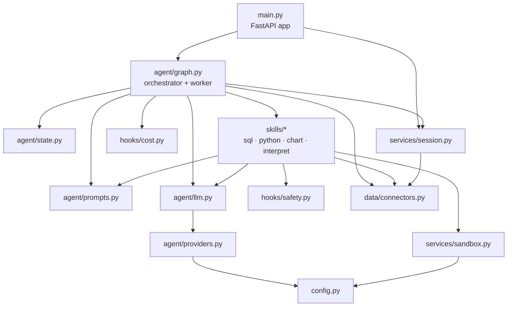
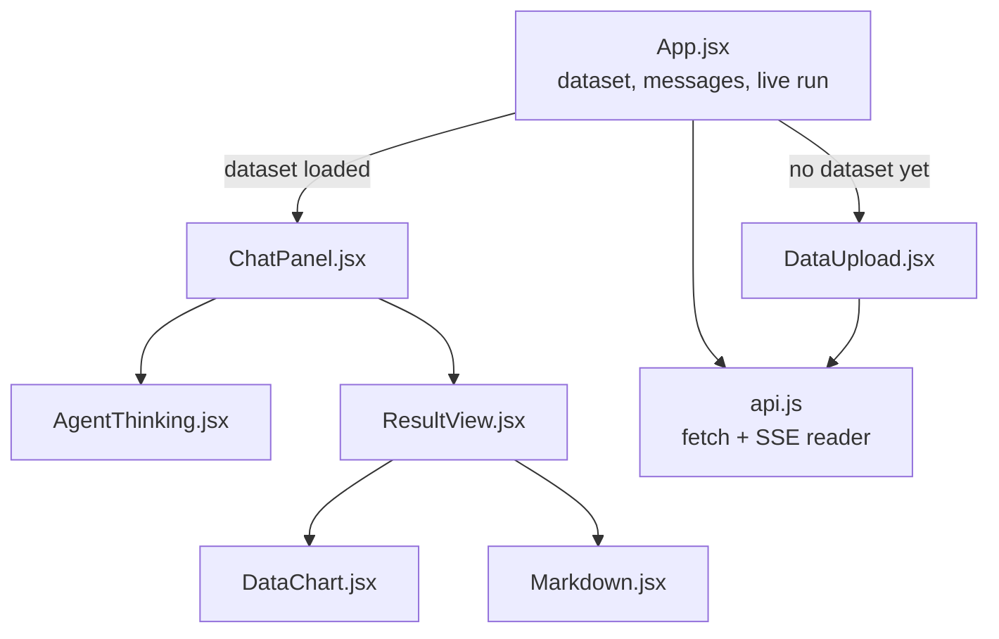

# Project guide

A walk through the codebase: what each file does, what happens between pressing enter and seeing an answer, and the bugs that shaped the design. Setup and configuration are in the [README](../README.md); the reasoning behind the graph design is in [architecture.md](architecture.md).

**On this page:** [Module map](#how-the-modules-connect) · [Backend](#the-backend) · [Frontend](#the-frontend-frontend) · [Life of a question](#life-of-a-question) · [Bugs found along the way](#bugs-found-along-the-way) · [Troubleshooting](#troubleshooting)

## How the modules connect

Arrows point from the caller to what it imports. Nothing lower down ever reaches back up.

## The backend

### The agent (`backend/app/agent/`)

| File | What it does |
| --- | --- |
| `graph.py` | Both state graphs. The **worker** graph is the plan-act loop (`plan` → `run_sql` / `run_python` / `make_chart` → back to `plan`) for one sub-question. The **orchestrator** graph wraps it: `decompose` → workers in parallel → `merge` → `verify` → `interpret`, with a bounded retry edge from `verify` back to `decompose`. Also holds `run()` and `stream()`. |
| `state.py` | `AgentState` belongs to the orchestrator; `BranchState` is one worker's private state (its sub-question, its DataFrame) and never leaves it. The fields several branches write at once, `branches` and `trace`, have additive reducers so parallel updates append instead of overwriting. |
| `prompts.py` | System prompts for the decomposer, planner, verifier and each skill. Written for small local models first: strict output rules and forced code fences. |
| `providers.py` | The provider registry. `LLM_PROVIDER` picks ollama or openai at runtime; each is one registered builder function. Also sorts failures into readable `ProviderError`s. |
| `llm.py` | What everything else calls: `complete()` for text, `structured()` for a validated pydantic object. One cached client per provider and model. No provider types leak out of this file. |

### Skills (`backend/app/skills/`)

One module per capability. Each exposes `NAME`, `DESCRIPTION` and `run(...)`, and returns a `SkillResult`.

| File | What it does |
| --- | --- |
| `sql_skill.py` | Question → SQL → validate → execute. A failed query goes back to the model with the error message for a bounded retry. |
| `python_skill.py` | Generates a pandas snippet, checks it, runs it in the sandbox. |
| `chart_skill.py` | Generates matplotlib code, runs it headless in the sandbox, returns the figure as a base64 PNG. |
| `interpret_skill.py` | Writes the final answer using only the numbers that were actually computed. |
| `base.py` | `SkillResult`, code-fence extraction (with a fallback for models that forget the fence), and column descriptions with types. |

### Hooks (`backend/app/hooks/`)

| File | What it does |
| --- | --- |
| `safety.py` | `validate_sql`: one statement, `SELECT`/`WITH` only, token-level keyword blocklist, row cap. `validate_python`: an AST walk that rejects imports, private and dunder attributes, frame introspection, dangerous builtins, and the pandas/numpy/matplotlib calls that touch the filesystem. |
| `cost.py` | `BudgetTracker` caps total planner steps at `MAX_AGENT_STEPS`. One tracker is shared by every branch, so it's lock-protected. |
| `logging_hook.py` | The app's logger, kept separate from uvicorn's root logger. |

### Data and services

| File | What it does |
| --- | --- |
| `data/connectors.py` | SQLAlchemy engines for CSVs (loaded into in-memory SQLite) and external databases, schema introspection, the JSON-safe row converter, and the per-engine read lock described in bug 6 below. |
| `services/session.py` | In-memory dataset registry with a size cap (LRU eviction) and a TTL, so a long-running server doesn't collect dead engines. |
| `services/sandbox.py` | Where generated code runs: read-only module views, about twenty allow-listed builtins, a copied DataFrame, captured stdout, an audit hook that refuses writes and processes, and the execution watchdog. |
| `main.py` | The FastAPI app: data endpoints, sync and streaming query endpoints, request ids, the optional login, and serving the built frontend in the deployment image. |
| `schemas.py` / `config.py` | API models, and settings that can all be overridden by environment variable. |

### Tests (`backend/tests/`)

The model is mocked everywhere, so the suite runs without Ollama. The fixtures in `conftest.py` also pin provider settings and clear provider env vars, so a developer's own `.env` or shell can't change the results.

### Sample data

`backend/data/samples/sales.csv` has 1,400 synthetic orders from January 2024 to October 2025 across 4 regions, 4 categories and 3 customer segments, with a trend, some seasonality, and 12 deliberate NULLs in `sales_rep`. Those NULLs turned out to matter (bug 2).

## The frontend (`frontend/`)

React and Vite, with no runtime dependencies beyond React itself. Markdown rendering and charts are written by hand to keep the bundle small and to avoid ever injecting model output as HTML.

| File | What it does |
| --- | --- |
| `src/App.jsx` | Owns the state: the loaded dataset, the message feed, the live run, and recent turns sent back for follow-up questions. |
| `src/api.js` | API client. `EventSource` can't POST, so the stream is read from the fetch body and the SSE frames are parsed by hand. |
| `src/components/DataUpload.jsx` | The landing screen: sample, CSV upload, database connection. |
| `src/components/ChatPanel.jsx` | Message feed, suggestion chips and the input box. |
| `src/components/AgentThinking.jsx` | The collapsible reasoning panel under each answer. Open with a spinner while running, folded to "Thought for N steps" when done. |
| `src/components/ResultView.jsx` | The answer, then each task's chart, table and generated code. Tasks are only labelled when there's more than one. |
| `src/components/DataChart.jsx` | Redraws bar and line charts as interactive SVG, and turns single-row results into KPI cards. |
| `src/components/Markdown.jsx` | Renders the small subset of markdown the model actually uses, as React elements. |

## Life of a question

Say the sample is loaded and you ask: *"Show revenue by region and revenue by category, both as charts."*

1. The browser POSTs to `/api/query/stream` with the question, the session id and the last few turns.
2. FastAPI checks the session exists and starts the graph on a background thread. Steps stream back as Server-Sent Events as each node finishes.
3. **`decompose`** decides the question has two independent parts. Most questions have one; it only splits when the parts don't depend on each other. Duplicate sub-questions are dropped here.
4. **Fan-out.** One LangGraph `Send` per sub-question, and the two workers run concurrently on separate threads.
5. **Each branch runs its own loop.** Its planner picks `sql`; the SQL skill writes a query, the guardrail checks it and caps the rows, it runs, and the rows are made JSON-safe. Back in the planner, the branch knows it owes a chart, so it picks `chart`; the chart code is checked and run in the sandbox. Then `answer`. Both branches do this at the same time, and their steps arrive interleaved.
6. **`merge`** is the join point. The reducer has already collected both summaries.
7. **`verify`** asks whether the results answer what was asked. If something requested is missing it sends the work back to `decompose` with a note, a bounded number of times.
8. **`interpret`** writes the answer from all branches' results, using only numbers that were computed.
9. The browser gets the `final` event: the answer, each branch's chart, table and code, and the verifier's verdict.

A simple question takes the same path with a single branch. `/api/query` does the same thing without streaming, which is handy for scripts.

## Bugs found along the way

These shaped the design more than anything else, so they're written down.

**1. The in-memory database was invisible to the server's threads.** An in-memory SQLite engine defaults to a per-thread connection pool, and FastAPI serves sync endpoints from a threadpool, so the thread answering `/api/query` saw an empty database. It worked in scripts and broke in the server. Fixed with `StaticPool` and `check_same_thread=False`.

**2. Invalid JSON on the stream.** `DataFrame.to_dict()` can produce `NaN`, which `json.dumps` writes as a bare `NaN` literal. Python parses that; a browser's `JSON.parse` doesn't. Any query touching the sample's NULL `sales_rep` values broke the UI. `numpy.int64` and `pandas.Timestamp` from a real database crashed `json.dumps` outright. Rows now go through pandas' own JSON encoder at the source.

**3. Parallel charts deadlocked the request.** pyplot keeps global state and isn't thread-safe. Once two branches could draw at the same time, one figure came back and the other threads hung for good. The parallelism tests used SQL-only branches, so they missed it. All plotting, through to encoding the PNG, now happens under one lock.

**4. A sandbox escape onto the filesystem.** The guard looked for `open`, `__import__` and `eval`, and missed that pandas is a filesystem library. `df.to_csv("/tmp/x.csv")` is an ordinary method call on an allowed name, so it passed and wrote real files. `to_pickle`/`read_pickle` was a route to arbitrary code execution. The readers and writers are now named and blocked.

**5. No limit on how long generated code could run.** Nothing rejected `while True:`, and in CPython a tight loop starves every other thread of the GIL, so one bad snippet froze the whole server. A watchdog now checks the clock between lines and stops the snippet at `SANDBOX_TIMEOUT_SECONDS`.

**6. Parallel branches silently corrupted each other's data.** The in-memory engines share one SQLite connection across threads (that's what fixed bug 1). Concurrent reads through that one connection interleaved their cursors and handed each other's rows over. Queries that should have returned 4, 4, 3 and 14 rows came back with 0, 5, 11 and 17, with no exception. Reads on shared-connection engines are now serialised behind a per-engine lock; real databases still run concurrently. The cost is negligible next to the model calls around each query.

**7. The shared step budget lost count.** `self.steps += 1` isn't atomic, and with three branches incrementing it together, steps went missing and the budget overran. Fixed with a lock.

**8. The 500 that lost its request id.** The global error handler built its response outside the request middleware, so crashes were the one response without an `X-Request-ID` header. Errors are now caught in the middleware itself.

**9. A dataset evicted mid-query** surfaced as a bare `KeyError` and a 500. It now returns a plain "that dataset is no longer loaded" answer.

**10. The sandbox could still reach `os` through the libraries.** pandas, numpy and pyplot import `os`, `sys` and `subprocess` at module level, so `pd.io.common.os.remove(...)` or `plt.sys.modules["subprocess"]` passed every check. So did a generator's `gi_frame.f_back.f_globals`, `df.query()` (pandas evaluates the string itself, attribute access included), and `df.apply("to_pickle", path=...)`, which writes a file without a single attribute node. The fix has three parts: snippets get read-only module views that won't return submodules, the AST guard rejects private attributes, frame introspection and method names passed as strings, and an audit hook refuses file writes, processes and sockets at runtime.

**11. The row cap could be dodged.** The SQL guard only appended a `LIMIT` when the word "limit" didn't appear anywhere, so a limit in a subquery or a comment left the outer query unbounded, and a model-chosen `LIMIT 100000` was kept. Only a trailing `LIMIT` counts now, and it's clamped to `MAX_SQL_ROWS`.

## Troubleshooting

| Symptom | Cause and fix |
| --- | --- |
| Answers fail instantly and the log shows connection errors to port 11434 | Ollama isn't running. Start the app (Windows/macOS) or `ollama serve` (Linux). |
| An error says the model wasn't found | It isn't pulled: `ollama pull qwen2.5`, or whatever `OLLAMA_MODEL` is set to. |
| A hosted provider says the model doesn't exist | Gateways rename models. Run `python list_models.py` from `backend/`. |
| Changed `.env` and nothing happened | It's read once at startup, and `--reload` only watches `.py` files. Restart the server. |
| First answer is very slow | The model loads into memory on first use. Later questions are faster. |
| Answers are wrong or SQL keeps retrying | Small local models are weak at SQL; you'll see the retries in the reasoning panel. Try a bigger model or a hosted provider. |
| Port 8000 or 5173 is in use | `uvicorn app.main:app --port 8001` or `npm run dev -- --port 5174`. |
| Upload rejected | Only `.csv` and `.tsv` are accepted, the file needs rows, and it has to be under `MAX_UPLOAD_MB`. |
| "Database connections are disabled" | `ENABLE_DB_CONNECT` is `false`, which the deployment image sets on purpose. |
