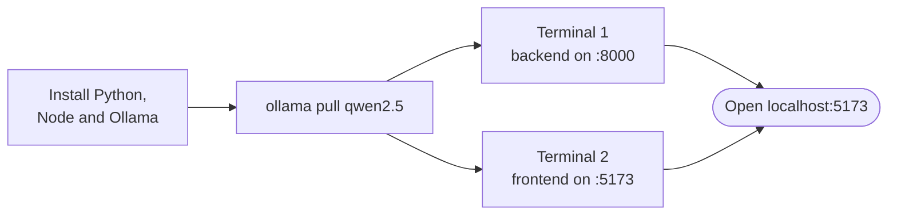

# Running on Windows


The README's quickstart, in PowerShell, plus the Windows-specific things that tend to go wrong.



## Prerequisites

- **Python 3.11 or newer** from https://www.python.org/downloads/windows/. Tick **"Add python.exe to PATH"** during install, then check with `python --version`.
- **Node.js 20.19 or newer** from https://nodejs.org (the LTS installer). Check with `node -v`.
- **Ollama** from https://ollama.com/download. It runs the model locally.
- **Docker Desktop**, only if you want the Docker option below.

## Option A: run it directly

### 1. Get the code and a model

```powershell
git clone https://github.com/asadaslam556/prism-data-agent.git
cd prism-data-agent
ollama pull qwen2.5
```

To use a different model, copy `backend\.env.example` to `backend\.env` and set `OLLAMA_MODEL`.

> Windows Explorer hides file extensions by default, so a file saved as `.env` can quietly become `.env.txt` and be ignored. In VS Code, use **File → New File**, then **Save As** and type `.env` exactly.

### 2. Start the backend (first terminal)

```powershell
cd backend
python -m venv .venv
.venv\Scripts\Activate.ps1
pip install -r requirements.txt
uvicorn app.main:app --reload --port 8000
```

If activation fails with `Activate.ps1 cannot be loaded`, PowerShell's execution policy is blocking it. Allow scripts for this terminal only, then activate again:

```powershell
Set-ExecutionPolicy -Scope Process -ExecutionPolicy Bypass
```

http://localhost:8000/api/health should return something like:

```json
{"status":"ok","version":"1.8.0","provider":"ollama","model":"qwen2.5","db_connect":true}
```

The `model` field is the model the backend will actually use.

### 3. Start the frontend (second terminal)

Leave the backend running and open another PowerShell window:

```powershell
cd prism-data-agent\frontend
npm install
npm run dev
```

Open http://localhost:5173, click **Load sample dataset**, and try *"Show the monthly revenue trend as a chart"*. Then *"Revenue by region as a chart and revenue by category"* to see it split into parallel tasks.

## Option B: Docker

Docker Desktop must be running.

```powershell
docker compose up --build
docker compose exec ollama ollama pull qwen2.5   # once
```

Frontend on http://localhost:5173, API on port 8000, Ollama on 11434. Stop it with `docker compose down`.

To use a different model:

```powershell
$env:OLLAMA_MODEL="your-model-name"
docker compose up --build
docker compose exec ollama ollama pull your-model-name
```

The compose stack ignores `backend\.env`: it only passes the backend `OLLAMA_BASE_URL`, `LLM_PROVIDER` and `OLLAMA_MODEL`, so it always runs on Ollama. To run a hosted provider in a container, use the single deployment image, which does read your `.env`:

```powershell
docker build -t prism .
docker run --rm -p 7860:7860 --env-file backend\.env prism
```

That serves the whole app on http://localhost:7860.

## Environment variables in PowerShell

PowerShell doesn't use `export`:

```powershell
$env:LLM_PROVIDER="openai"
$env:OPENAI_API_KEY="sk-..."
```

These only last for the current terminal. For anything permanent, put it in `backend\.env`. The README covers the hosted setup, including the extra setting DeepSeek needs.

## When a change doesn't seem to take effect

The backend reads its config once at startup, and `--reload` only watches `.py` files. Editing `backend\.env` does nothing until you stop the server with Ctrl+C and start it again. This is the usual cause of "I changed the setting and nothing happened".

If that's not it, check nothing old is still holding the port:

```powershell
netstat -ano | findstr :8000
```

More than one PID means an old server is still running. Stop it with `taskkill /PID <pid> /F`.

For a completely clean slate, rebuild both halves:

```powershell
cd backend
Remove-Item -Recurse -Force .venv
python -m venv .venv
.venv\Scripts\Activate.ps1
pip install --no-cache-dir -r requirements-dev.txt

cd ..\frontend
Remove-Item -Recurse -Force node_modules
npm install
```

In practice this rarely fixes anything by itself, but it does rule out a broken dependency install.

## Running the checks

```powershell
cd backend
.venv\Scripts\Activate.ps1
pip install -r requirements-dev.txt
python -m pytest
ruff check app tests list_models.py

cd ..\frontend
npm run build
```

These are the same checks CI runs.

## Troubleshooting

| Symptom | Cause and fix |
| --- | --- |
| `Activate.ps1 cannot be loaded` | Execution policy. Run `Set-ExecutionPolicy -Scope Process -ExecutionPolicy Bypass`, then activate again. |
| `python` or `node` isn't recognised | Not on PATH. Reinstall Python with "Add python.exe to PATH" ticked, or open a new terminal after installing. |
| Answers fail instantly with connection errors to port 11434 | Ollama isn't running. Start it from the Start menu. |
| The model isn't found | Pull it: `ollama pull qwen2.5`, or whatever `OLLAMA_MODEL` is set to. |
| `/api/health` shows a different model than you set | `backend\.env` wasn't picked up. Check it's named `.env`, not `.env.txt`, and restart the backend. |
| Port 8000 or 5173 is in use | `uvicorn app.main:app --reload --port 8001` or `npm run dev -- --port 5174`. |
| First answer is very slow | The model loads into memory on first use. Keep Ollama running. |

More in the [guide's troubleshooting table](guide.md#troubleshooting).
